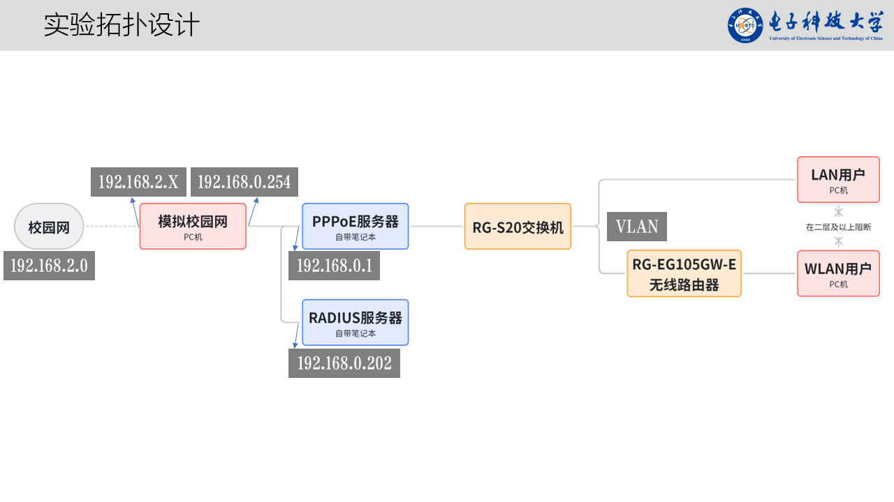
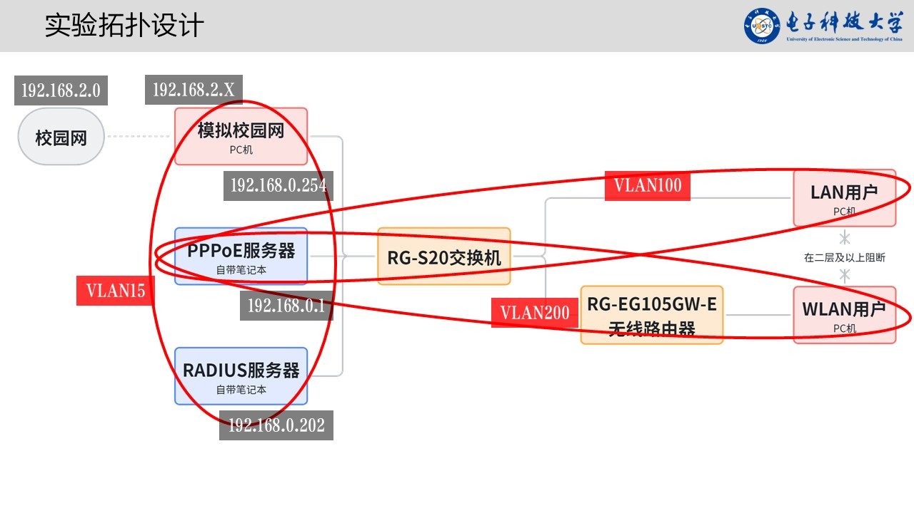

> 注意：此文档是以下图一为拓扑进行的配置，后由于课程要求拓扑更新为下图二。

图一：



图二：



## 1. 任务背景

本实验来自《网络接入控制综合设计》。

目标是用一台运行 Windows 10 的 PC 模拟一个“上游出口设备”：

- 一侧接入校园网，从校园网 DHCP 获取地址，假设为 `192.168.2.X`

- 另一侧连接学生搭建的实验网络，直接相连设备是 PPPoE 服务器

- PC 在实验网这一侧的地址必须为 `192.168.0.254`

- PPPoE 服务器上联口地址为 `192.168.0.1`

- 下游上网设备通过 PPPoE 服务器接入网络，由 PPPoE 服务器负责接入控制

- 最终下游设备需要能够经由该 PC 访问校园网

这台 PC 不是普通终端，而是实验网连接校园网的上游网关。

## 2. 需要完成什么

你接手后，需要把这台 Windows 10 PC 配成一个双网口网关，使其满足以下要求：

- 校园网侧自动获取 `192.168.2.X`

- 实验网侧手工配置 `192.168.0.254/24`

- PPPoE 服务器把这台 PC 作为上游默认网关

- PC 负责把实验网流量转发到校园网

- PC 负责做 NAT，避免校园网侧需要额外配置静态回程路由

建议采用最稳妥的实现方式：`双重 NAT`

- PPPoE 服务器先把拨号用户流量转换成 `192.168.0.1`

- Windows 10 PC 再把 `192.168.0.0/24` 的流量转换成校园网侧的 `192.168.2.X`

这是当前会话中最推荐的落地方案，因为它对校园网环境要求最低，成功率最高。

## 3. 网络角色和拓扑

```text
 校园网
   ^
   |  DHCP: 192.168.2.X
   |  默认网关: 校园网网关
 Windows 10 PC
   校园网口: 192.168.2.X
   实验网口: 192.168.0.254/24
   作用: 上游出口 / 转发 / NAT
   ^
   |  默认网关指向这里
   |  192.168.0.254
 PPPoE 服务器
   上联口: 192.168.0.1/24
   作用: PPPoE 认证 / 地址分配 / 接入控制
   ^
   |  PPPoE 会话
 拨号终端
地址: 由 PPPoE 服务器分配
```

## 4. 必须理解的关键点

- `192.168.0.254` 不是因为地址大才被选为网关，而是因为这台 PC 真正连接校园网，是通向外部网络的下一跳。

- `192.168.0.1` 是 PPPoE 服务器的上联地址，不是校园网出口。

- 对 PPPoE 服务器来说，默认网关应设为 `192.168.0.254`。

- 对 PPPoE 拨号终端来说，它的第一跳是 PPPoE 服务器，而不是直接看到 `192.168.0.254`。

- `192.168.0.0/24` 这个网段只需要用于 PC 和 PPPoE 服务器之间这一段。

- VLAN 是二层隔离概念，不要求 PPPoE 用户地址一定和 `192.168.0.0/24` 同网段。

## 5. 实验要求对应到 PC 的功能

- 充当实验网连接校园网的上游出口

- 作为 PPPoE 服务器的默认网关

- 负责实验网到校园网的三层转发

- 负责 NAT

- 避免把实验网直接暴露到校园网

这台 PC 不负责 PPPoE 认证本身，PPPoE 认证和用户地址分配仍然由 PPPoE 服务器完成。

## 6. 硬件和软件前提

- 一台 Windows 10 PC

- 至少两张独立网卡，或者两个独立 RJ45 口

- 管理员权限

- 与 PPPoE 服务器直连的网线

- 校园网接入网线

建议在操作前确认：

- 两张网卡都已被系统识别

- 网卡驱动正常

- 可以使用管理员 PowerShell

## 7. 推荐实施方案

优先采用以下方案：

- Windows 10 PC 负责 `192.168.0.0/24 -> 192.168.2.X` 的 NAT

- PPPoE 服务器负责下游 PPPoE 用户管理

- PPPoE 服务器最好也对下游拨号用户做一次 NAT，把所有用户流量先汇总成 `192.168.0.1`

这样做的原因：

- 简化 Windows 10 上的路由设计

- 降低校园网不接受私有回程路由时的失败风险

- 验收路径更清晰

## 8. Windows 10 上的具体操作步骤

### 8.1 物理连接

- 网卡 1 接校园网

- 网卡 2 接 PPPoE 服务器上联口

### 8.2 重命名网卡

打开：

- `Win + R`

- 输入 `ncpa.cpl`

建议把两块网卡改名为：

- `Campus`

- `Lab`

这样后续 PowerShell 配置更不容易出错。

### 8.3 配置校园网口

在 `Campus` 网卡上设置：

- IPv4 地址：自动获取

- DNS：自动获取

说明：

- 这块网卡应从校园网 DHCP 拿到 `192.168.2.X`

- 这块网卡应获得默认网关

### 8.4 配置实验网口

在 `Lab` 网卡上手工设置 IPv4：

- IP 地址：`192.168.0.254`

- 子网掩码：`255.255.255.0`

- 默认网关：留空

- DNS：留空

说明：

- 实验网口不要配置默认网关

- 默认网关只能存在于校园网口

### 8.5 禁止使用桥接和 ICS

不要做以下操作：

- 不要建立“网络桥接”

- 不要优先使用 `ICS (Internet Connection Sharing)`

原因：

- 桥接会破坏该实验要求的三层边界

- ICS 常会把内网口改成 `192.168.137.1`，与题目要求的 `192.168.0.254` 冲突

### 8.6 用管理员 PowerShell 开启转发

先查看网卡名：

```powershell
Get-NetAdapter
```

确认名称后，启用两块网卡的转发：

```powershell
Set-NetIPInterface -InterfaceAlias "Campus" -Forwarding Enabled
Set-NetIPInterface -InterfaceAlias "Lab" -Forwarding Enabled
```

### 8.7 在 Windows 10 上创建 NAT

推荐方案下，Windows 10 只需要对 `192.168.0.0/24` 做 NAT：

```powershell
New-NetNat -Name "CampusNAT" -InternalIPInterfaceAddressPrefix 192.168.0.0/24
```

检查结果：

```powershell
Get-NetNat
ipconfig
route print
```

### 8.8 如果采用“非双重 NAT”方案

如果 PPPoE 服务器不对拨号用户做 NAT，而是直接向用户分配独立网段，例如 `10.10.10.0/24`，则 Windows 10 还需要知道这个网段应该从哪里走。

可增加一条静态路由：

```cmd
route -p add 10.10.10.0 mask 255.255.255.0 192.168.0.1
```

这种情况下，Windows 侧 NAT 设计也应覆盖该 PPPoE 用户网段。

但本实验不建议优先走这条路线，除非你确认 PPPoE 服务器不支持或不适合做下游 NAT。

## 9. PPPoE 服务器侧需要对接的配置

需要明确告诉负责 PPPoE 服务器的同学：

- PPPoE 服务器上联口地址设为 `192.168.0.1/24`

- PPPoE 服务器默认网关设为 `192.168.0.254`

- 下游用户地址池可以使用独立网段，例如 `10.10.10.0/24`

- 如果想提升实验成功率，建议 PPPoE 服务器先把下游用户流量 NAT 成 `192.168.0.1`

必须避免的错误：

- 不能把 PPPoE 服务器自己的默认网关设成 `192.168.0.1`

- 不能认为整个 `192.168.0.0/24` 网段天然都以 `192.168.0.1` 为出口

## 10. VLAN 相关说明

- 如果 VLAN 只出现在 PPPoE 服务器下联交换机和终端之间，Windows 10 PC 通常不需要做 VLAN 配置

- PPPoE 用户地址不需要和 `192.168.0.0/24` 同网段

- 只有在 PC 和 PPPoE 服务器之间这条链路本身要跑 trunk 时，才需要考虑 Windows 网卡驱动是否支持 VLAN tagging

按目前实验描述，一般不需要在这台 Windows 10 PC 上配置 VLAN。

## 11. 推荐验收顺序

### 11.1 先验收 PC 本机状态

在 Windows 10 上执行：

```powershell
 ipconfig
 Get-NetNat
route print
```

预期结果：

- 一块网卡拿到 `192.168.2.X`

- 一块网卡是 `192.168.0.254`

- 校园网口存在默认路由

- 实验网口没有默认网关

- NAT 已创建成功

### 11.2 验收 PC 与 PPPoE 服务器互通

- 在 Windows 10 上 `ping 192.168.0.1`

- 在 PPPoE 服务器上 `ping 192.168.0.254`

### 11.3 验收上游通路

- 在 PPPoE 服务器上测试是否可通过 `192.168.0.254` 访问校园网方向资源

### 11.4 验收终端拨号结果

- 让终端完成 PPPoE 拨号

- 确认终端获得 PPPoE 地址

- 确认终端能访问校园网资源

## 12. 常见误区

- 误区 1：把这台 PC 当成普通主机 实际上它是网关设备。

- 误区 2：给实验网口也配置默认网关 这样会导致路由混乱。

- 误区 3：使用 Windows 网络桥接替代路由/NAT 这不符合实验目标。

- 误区 4：直接使用 ICS 很可能破坏题目要求的地址规划。

- 误区 5：认为 PPPoE 用户地址必须属于 `192.168.0.0/24` 实际上不需要。

- 误区 6：把 `192.168.0.1` 作为整个系统最终出口 实际出口是连接校园网的 `192.168.0.254`

## 13. 风险和备选方案

如果在 Windows 10 上出现以下问题：

- `New-NetNat` 不可用

- Windows 10 裸机 NAT 行为异常

- 校园网策略限制明显

备选方案：

- 在这台 PC 上运行 `OpenWrt` 或 `pfSense` 虚拟机

- 将两张物理网卡交给虚拟机作为 WAN/LAN

- 由虚拟机承担转发和 NAT 职责

这通常比继续硬扛 Windows 10 的桌面版网络能力更稳。

## 14. 补充内容

> 这台 Windows 10 PC 不是普通终端，而是实验网连接校园网的上游网关。请把它配置成双网口路由/NAT 设备：校园网口 DHCP 获取 `192.168.2.X`，实验网口手工设为 `192.168.0.254/24`，且实验网口不要配默认网关。PPPoE 服务器上联口应为 `192.168.0.1/24`，其默认网关必须指向 `192.168.0.254`。Windows 10 上不要做桥接，不要优先用 ICS，需要启用 IP 转发并创建对 `192.168.0.0/24` 的 NAT。推荐让 PPPoE 服务器先把拨号用户流量 NAT 成 `192.168.0.1`，再由这台 PC 把 `192.168.0.0/24` NAT 到校园网。完成后按 `ipconfig`、`Get-NetNat`、`route print`、双向 ping 和终端拨号上网顺序验收。VLAN 如果只在 PPPoE 服务器下游使用，这台 PC 一般不用配置 VLAN。`

## 15. 交付标准

- Windows 10 PC 校园网口成功获取 `192.168.2.X`

- Windows 10 PC 实验网口固定为 `192.168.0.254/24`

- PPPoE 服务器上联口为 `192.168.0.1/24`

- PPPoE 服务器默认网关为 `192.168.0.254`

- Windows 10 上转发和 NAT 已开启

- PC 与 PPPoE 服务器双向可达

- PPPoE 终端拨号后可访问校园网
