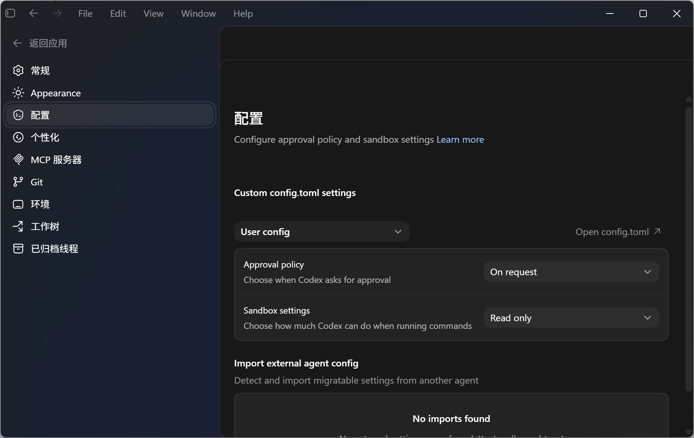
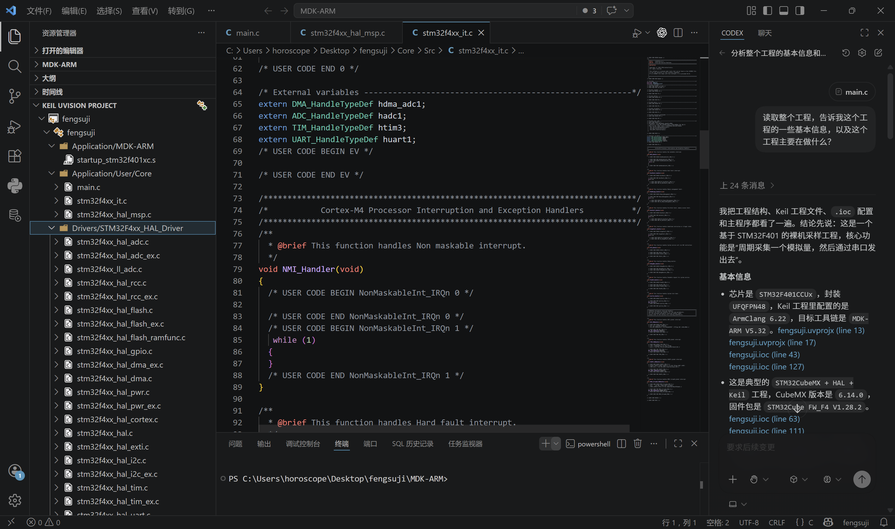

> 几个月没写博客了，这篇博客就最近几个月使用 codex 的心得来写一篇 codex 的入门教程，有内容上不妥或可以改进的地方欢迎各位在评论区指出。

> 

- 为什么要使用 codex ？作为 **agent** 级别的AI工具，天生比网页端的 chatgpt 具有更强的能力，可以直接读取和写入文件，代替用户在系统中进行操作，尤其体现在Linux系统（例如云服务器）中。

- 为什么不使用 Claude code ？由于目前 Claude 对账号开启了实名认证，加上其昂贵的价格以及对国区用户的不友好对待， OpenAI 的 codex 或许是目前国内用户使用 AI agent 工具的最优解。

- 为什么使用中转站而非从官方购买 API ？虽然中转站面临**隐私泄露、安全风险、模型降级**等问题，但是**可以直连使用、价格显著低于官方**成为我选择中转站的主要原因。读者也可以结合自身需求选择合适的 API 渠道。

# 安装 codex

主要参考[菜鸟教程](https://www.runoob.com/codex/codex-install.html)的这篇教程。

### Windows 版本的安装

首先访问 [codex官网](https://chatgpt.com/zh-Hans-CN/codex/get-started/)，下载安装器，再运行安装器进行安装即可。（过程需要魔法）

### Mac 版本的安装

略。

### Linux 版本（codex CLI）的安装

依次运行下面的命令。

```bash
sudo apt update
sudo apt install nodejs
sudo apt install npm
```

```
# 对于国外云服务器，推荐使用官方镜像安装
sudo npm install -g @openai/codex
# 对于物理机或国内云服务器，使用国内镜像安装更快
sudo npm install -g @openai/codex --registry=https://registry.npmmirror.com
# 更新到最新版本（可选）
npm update -g @openai/codex
# 或强制重装最新版（可选）
npm install -g @openai/codex@latest
# 卸载（可选）
npm uninstall -g @openai/codex
```

之后在终端中直接使用命令 `codex` 即可启动。

### codex for VScode 插件的安装

codex 的 VScode 插件能在我们开发某个具体的项目时提供巨大的便利。由于**单独安装 codex 插件后不能修改API的请求来源**，所以对于使用中转站的用户，应当先安装 Windows 版本的 codex ，再按照本文接下来的内容修改 codex 的配置文件，最后安装 codex 的 VScode 插件。如此一来， **codex 插件会自动复用桌面版 codex 的配置文件**，以满足我们使用中转站的需求。

# 配置 codex API

使用中转站需要用户在 codex 的配置文件中修改两处，一个是**请求来源**，另一个是我们在中转站中创建的 **API密钥**（一般以`sk-`开头）。

通常我们使用的中转站都会在首页显眼处告诉用户如何修改 codex 配置文件。以我正在使用的两家中转站为例（并非广告，不含推广链接，仅为想要尝试使用 codex 的朋友提供一个可选项）：

Owl AI（订阅制）[https://api.owlai.tech/home](https://api.owlai.tech/home)

遂人 API（按量付费制）[https://api.haokun.de/](https://api.haokun.de/)

下面以 Owl AI 为例演示如何修改 codex 配置文件。

### Windows 版

[](./image_1.png)

点击右侧的 Open config.toml，在将配置文件替换为下面的内容（仅以我的为例）：

```toml
model_provider = "OpenAI"
model = "gpt-5.4"
review_model = "gpt-5.4"
model_reasoning_effort = "xhigh"
disable_response_storage = true
network_access = "enabled"
windows_wsl_setup_acknowledged = true
model_context_window = 1000000
model_auto_compact_token_limit = 900000

[model_providers.OpenAI]
name = "OpenAI"
base_url = "https://api.owlai.tech"
wire_api = "responses"
requires_openai_auth = true

model = "gpt-5.4"
model_reasoning_effort = "medium"

[windows]
sandbox = "elevated"

[features]
multi_agent = true
```

这样就配置好了请求来源，通常也就是中转站的网址。**API密钥的配置在初次启动 codex 就以及要求用户输入了，如果不确定可以从左下角退出重新输入API进行登录。**

配置完成后， codex 的 VScode 插件会自动复用桌面版 codex 的配置文件，无需二次配置。

### Linux 版（codex CLI）

使用下面的命令打开codex的配置文件，再将配置文件替换为下面的内容（仅以我的为例）：

```
nano ~/.codex/config.toml`

```
model_provider = "OpenAI"
model = "gpt-5.4"
review_model = "gpt-5.4"
model_reasoning_effort = "xhigh"
disable_response_storage = true
network_access = "enabled"
windows_wsl_setup_acknowledged = true
model_context_window = 1000000
model_auto_compact_token_limit = 900000
approvals_reviewer = "user"

[model_providers.OpenAI]
name = "OpenAI"
base_url = "https://api.owlai.tech"
wire_api = "responses"
requires_openai_auth = true

model = "gpt-5.4"
[projects."/root"]
trust_level = "trusted"

[notice]
hide_full_access_warning = true

[notice.model_migrations]
"gpt-5.3-codex" = "gpt-5.4"
```

再使用下面的命令打开存放API密钥的配置文件，对引号中的密钥进行替换（初次启动 codex 时其实已经要求用户输入过）：

```bash
nano ~/.codex/auth.json
```

```
{
  "OPENAI_API_KEY": "**sk-1234567890abcd**"
}
```

# codex 使用技巧

这部分主要以 codex CLI 为例来写，因为大部分功能在桌面版 codex 中都可以在设置中找到，非常方便。

### 指定审批模式（权限设置）

在对话框中输入：

```
/approvals`

即可手动选择审批模式。默认模式为对话模式，读写文件时需要用户确认才会继续运行。**full access** 模式会授予 codex 系统级权限，任何读写和修改操作都会自动执行。使用此模式比较方便省力，但是也需要用户承担 **误删数据**、**系统崩溃** 的风险。

### 启用计划模式

对于大型、复杂的项目，我们可以先让 codex 设计出一套完整的解决方案，然后不断对方案进行修改和优化，在用户审核并通过解决方案后再开始在系统中实施。

在对话框中输入：

```
/plan
```

即可启用计划模式，在这个模式中， codex 不会执行任何实际操作，而是通过不断与用户对话来修改和完善方案。在 codex 认为方案完善时会主动提出退出计划模式，询问用户是否按照既定方案进行执行。

### 恢复历史会话

恢复历史会话是我们在使用 AI 工具时的重要功能。我们可以在需要时重新检查对话内容，甚至继续未完成的对话。

在 codex 未启动时，输入：

```
codex resume`

即可查找历史会话。也可以使用下面的命令直接恢复到上一个会话：

```bash
codex resume --last
```

### 设置全局提示词

全局提示词默认保存在`~/.codex/instructions.md`，你可以通过修改这个 markdown 文件的内容来修改全局提示词。这些指令会对所有对话生效，相当于给 codex 设定固定的“行为规则”。你可以在全局提示词中写一些**有关输出的格式规范**、**执行操作前先检查环境**之类的话。

### 配置 MCP 和 skill

通过 MCP（Model Context Protocol）协议，codex 可以接入外部工具和服务，而 skill 则更像对于 AI agent 的一种行为规范。这里仅阐明 codex 的功能，具体如何配置请查阅资料或直接询问 codex 。

### 导出 codex 的对话记录

虽然我们与 codex 的对话记录是保存在本地的，我们也可以随时通过`codex resume`来查阅历史对话，但是 codex 仍未提供直接将对话记录导出为文件的功能。我这里使用的是 GitHub 上的 [waylog](https://github.com/shayne-snap/waylog-cli) 工具来实现：

```bash
# 安装waylog
cargo install waylog
# 或者
brew install shayne-snap/tap/waylog
```

安装完成后先添加到 bath 中，再执行 `waylog pull` 即可。

[ GitHub](https://github.com/)[shayne-snap/waylog-cli](https://github.com/shayne-snap/waylog-cli)  

# codex 在嵌入式开发中的应用

下面这个视频是我今天写这篇博客的导火索，这也许真的是未来的一种嵌入式开发方式：

<iframe src="https://player.bilibili.com/player.html?bvid=BV1vED9BqEiJ&p=1&autoplay=0" scrolling="no" frameborder="0" allowfullscreen="true" style="width:100%;aspect-ratio:16/9;"></iframe>

通过 keil assistant 插件使 VScode 直接调用 keil 的功能，加上 codex for VScode 插件带来的 AI 加持，我们可以通过现代且美观的 vscode 编辑器来完成嵌入式软件的开发。

[](./image_3.png)

还有下面这个视频，效果也是非常惊人的。

<iframe src="https://player.bilibili.com/player.html?bvid=BV11VXMBcEut&p=1&autoplay=0" scrolling="no" frameborder="0" allowfullscreen="true" style="width:100%;aspect-ratio:16/9;"></iframe>

# 后记

到目前为止，AI agent 一直保持着一种迅猛发展的势头。我目前对待 AI 的态度是，它可以代替人完成一些重复性、基础性的任务，让人们可以把更多时间和精力放在**设计任务**和**拆分任务**上。无论对于硬件人还是软件人，AI 辅助开发都是一个杠杆。希望 AI 能成为电赛中有用、好用的工具，为大家在紧张的四天三夜中节省打字和检查代码的时间。哪怕是仅仅通过与 codex 对话也不失为一种不错的学习办法。