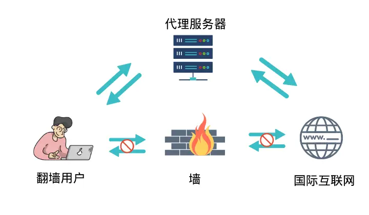
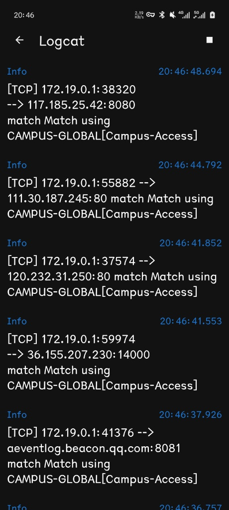
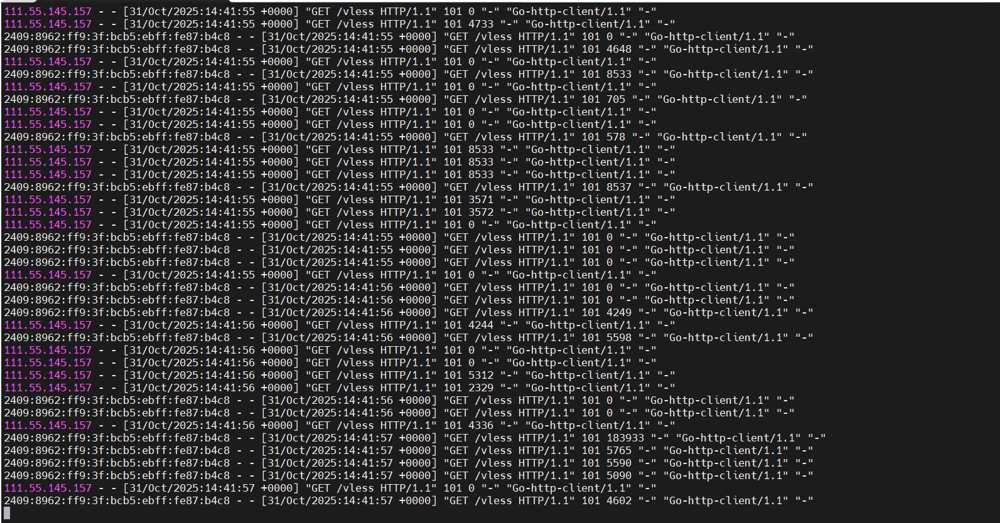
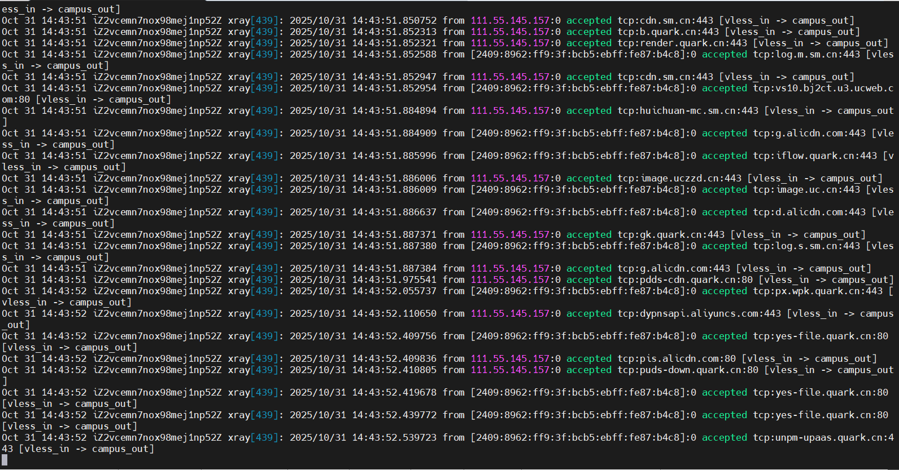
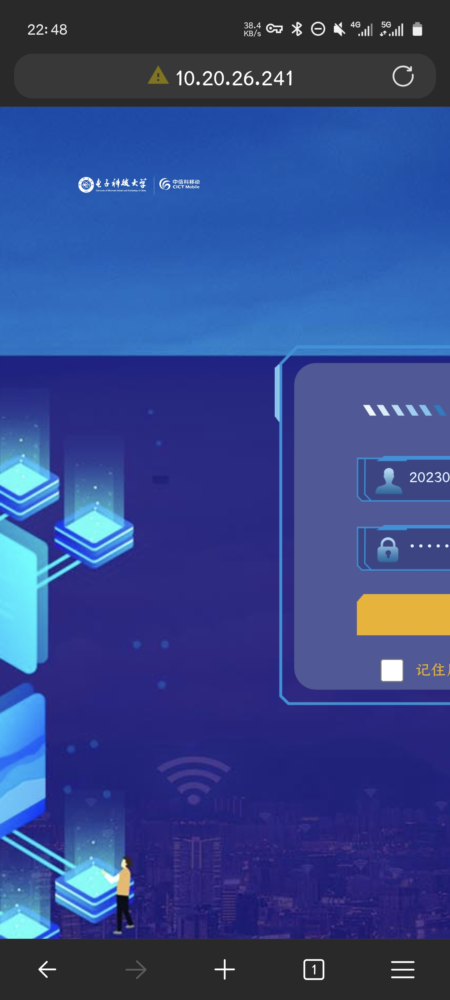
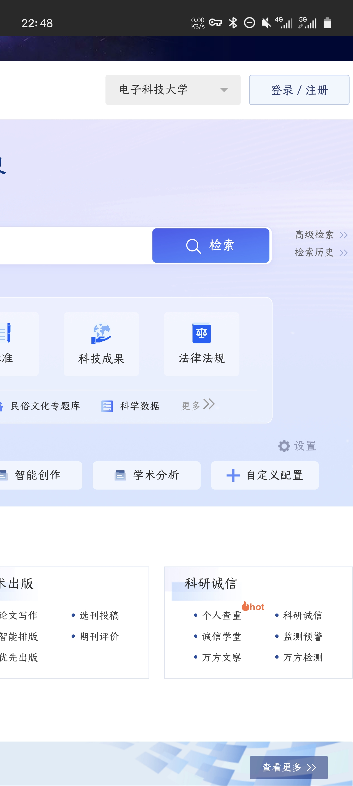

## 背景

上一篇：[优雅地访问校园网之Frp工具入门 – horoscope](https://horoscope.xtkx.site/archives/95)

上一篇文章中我们了解到，可以通过frp访问校园网内特定IP特定端口的服务，那么“远程连接”、“在线实验”这种需求也算是圆满解决了。但是，实际用起来才发现有一些不便：每当我需要访问一个新的内网服务，我必须先把这个服务的IP和端口号写入frpc.toml配置文件中。这离“访问校园网全部服务”的目标还有很远的距离。那么有没有一种方式，可以把身在外网的“我”完全置于校园网的内网环境中呢？这很难不让人联想到我们解决[GFW（Great Firewall of China）](https://baike.c114.com.cn/view.php?id=23004-44A3EE4E)时使用的办法：代理。只需一键启动clash，就可以完全置身国外。这样的解决方案不可谓不优雅。

在使用代理时，我们通常会把购买得到的clash订阅连接导入clash客户端，客户端会通过订阅链接获取节点。通过这些节点中转，我们便可以访问被GFW阻止的服务。原理示意图如下：（图源[网络](https://pic1.zhimg.com/80/v2-dc19c0d872293294d4826c858a6deab6_720w.png)）

[](./image_1.png)

同理，是不是我们只需要让云服务器来作为代理服务器中转，就可以访问校园网了呢？

答案显然是否定的。当GFW在工作过程中，GFW阻止的是内网用户向外的特定连接请求，即“我”身处内网，这时只需要请求未被封锁、身处外网的代理服务器中转连接请求即可成功访问；在校园网工作过程中，情况有所不同：校园网阻止的是外网用户向内的全部连接请求，“我”和云服务器都身处外网。所以，“我”无法访问的内网服务，云服务器也无能为力。

## 线索

解决问题的线索在于把clash和frp“合为一体“。既然通过frp我们已经打通了校园网从外向内访问的这堵墙，那么解决问题就易如反掌了：**当身处外网的用户想要访问呢校园网内网服务时，请求先发送给云服务器上的代理服务程序，代理服务程序通过frp建立的隧道将流量发送到内网中的frpc客户端，从这台电脑”落地“，再向内网服务器发送请求**，返回时的流量路径也是一样的。在这个过程中，流量先后经过云服务器B和校内网主机A两次中转。

通过向Gemini老师虚心请教，Gemini给出了一条切实可行的方案：`[外网设备 (Clash)]` -> `[B: Xray (Inbound)]` -> `[B: Xray (SOCKS Outbound)]` -> `[B: frps]` -> `[A: frpc]` -> `[A: SOCKS5]` -> `[校园网]`

以下内容节选自Gemini的回答：

**Host A (Win10, 校园网):**
运行一个SOCKS5代理（用 Xray 实现），监听 127.0.0.1:10808。
运行 frpc (frp客户端)，将本地的 127.0.0.1:10808 端口通过隧道穿透到服务器B。
**Server B (Debian, 公网IP):**
运行 frps (frp服务端)，监听 frpc 的连接，并将A的隧道端口 10808 暴露在B的 127.0.0.1:7001 上。
运行 Xray ，配置公网入口 (如 443 端口)。
配置 Xray 的 出站(outbound)，使其不直接访问互联网，而是将所有流量转发到 127.0.0.1:7001 (即frp隧道的出口)。
**Client (Clash):**
连接到 Server B 的 Xray 节点。

*所有流量被 B 上的 Xray 接收；在云服务器B内部，Xray 将收到的流量转发给 frp 隧道，进入 A；在内网主机A内部，由 frp 隧道收到的流量送给A上的 SOCKS5 代理，再从这里流出A，流向内网的各个端口。*

## 实操

既然理论成立，那么直接用实践来验证一下。

**注意：以下内容仅为不完全记录笔者配置过程，只按照本文内容进行操作可能不足以搭建可用的clash节点，如想要尝试复现需要具备搜索网络资料的能力，也欢迎读者朋友与我交流学习。**

**1.在A上安装 SOCKS5 代理 (使用 Xray)**
从 [Xray-core GitHub Releases](https://github.com/XTLS/Xray-core/releases) 下载最新的 `Xray-windows-64.zip`。

::github{repo="XTLS/Xray-core"}

解压到一个目录，例如 `C:\Xray`。
在 `C:\Xray` 目录下创建一个 `config.json` 文件，内容如下：

```json
{
  "log": {
    "loglevel": "warning"
  },
  "inbounds": [
    {
      "port": 10808,
      "listen": "127.0.0.1",
      "protocol": "socks",
      "settings": {
        "auth": "noauth", // 仅本地使用，无需认证
        "udp": true
      }
    }
  ],
  "outbounds": [
    {
      "protocol": "freedom" // 允许SOCKS5代理访问任何地址（即校园网）
    }
  ]
}
```

在该目录下打开命令提示符(CMD)并运行 `xray.exe` 或 `.\xray.exe`。保持此窗口开启。

**2.分别在A和B上安装 frpc 和 frps**（略，详见[上一篇](https://horoscope.xtkx.site/archives/95)）

**3.在B上安装 Xray **
安装 Xray:

```bash
bash -c "$(curl -L https://github.com/XTLS/Xray-install/raw/main/install-release.sh)" @ install
```

生成 REALITY 密钥对:

```bash
xray core genkey -l
```

配置 Xray: 编辑 `/usr/local/etc/xray/config.json`

```json
{
  "log": {
    "loglevel": "warning"
  },
  "inbounds": [
    {
      "port": 443, // 监听公网 443 端口
      "protocol": "vless",
      "settings": {
        "clients": [
          {
            "id": "替换为你自己的UUID", // 使用 uuidgen 命令生成
            "flow": "xtls-rprx-vision"
          }
        ],
        "decryption": "none"
      },
      "streamSettings": {
        "network": "tcp",
        "security": "reality",
        "realitySettings": {
          "show": false,
          "dest": "www.microsoft.com:443", // 伪装成访问微软
          "xver": 0,
          "serverNames": [
            "mycampus.yourdomain.com" // 你的域名
          ],
          "privateKey": "填入你生成的REALITY私钥", // 步骤2中的 PrivateKey
          "shortIds": [
            "填入你生成的ShortId" // 步骤2中的 ShortId (公钥)
          ]
        }
      },
      "tag": "vless_in" // 给这个入口打上标签
    }
  ],
  "outbounds": [
    {
      "protocol": "socks",
      "settings": {
        "servers": [
          {
            "address": "127.0.0.1",
            "port": 7001 // 关键：指向 frps 暴露在本地的端口
          }
        ]
      },
      "tag": "campus_out" // 校园网出口
    },
    {
      "protocol": "freedom",
      "tag": "direct" // 默认备用出口
    }
  ],
  "routing": {
    "rules": [
      {
        "type": "field",
        "inboundTag": [
          "vless_in" // 匹配 VLESS 入口
        ],
        "outboundTag": "campus_out" // 强制所有流量走向 "campus_out" (frp隧道)
      }
    ]
  }
}`

由于我的云服务B已经运行了一个网页服务，如果再让 Xray 监听443端口就会产生冲突。我的解决方案如下：

**第一步：**由Nginx 监听 443 端口，通过域名 (SNI) 和路径 (Path) 来区分流量。（我这里选择路径，也就是在主域名后面加上 /path 这样的后缀。）
访问 xtkx.site/vless (或者一个你自定义的路径) 的流量 -> Nginx 将其反代给在本地 (如 127.0.0.1）监听另一个端口（我自定义为了 11000）的 Xray 服务。
为了实现这种Nginx反代，Xray不能再使用 REALITY 协议（因为REALITY要求Xray自己处理TLS）。我们必须切换到 VLESS + WebSocket (WS) + TLS 的组合。
修改 Nginx 的 /etc/nginx/conf.d/xtkx.site.conf 配置文件，添加 Xray (VLESS+WS) 的分流配置

```nginx
location /vless { # ❗️ 关键: 请将 /vless-ws-path 修改为您自己的私密路径
        if ($http_upgrade != "websocket") { # 强制 WebSocket
           return 400;
        }
        
        proxy_pass http://127.0.0.1:11000; # ❗️ 关键: 确保 11000 与 Xray 监听的端口一致
        proxy_http_version 1.1;
        proxy_set_header Upgrade $http_upgrade;
        proxy_set_header Connection "upgrade";
        proxy_set_header Host $host;
        proxy_set_header X-Real-IP $remote_addr;
        proxy_set_header X-Forwarded-For $proxy_add_x_forwarded_for;
    }
```

**第二步：**修改 B 服务器上的 Xray (config.json)，请完全替换 /usr/local/etc/xray/config.json 的内容为：

```json
{
  "log": {
    "loglevel": "warning"
  },
  "inbounds": [
    {
      "port": 11000,             // ❗️ 匹配 Nginx 的 proxy_pass 端口 11000
      "listen": "127.0.0.1",   // ❗️ 匹配 Nginx 的 proxy_pass 地址 127.0.0.1
      "protocol": "vless",
      "settings": {
        "clients": [
          {
            "id": "YOUR_OWN_UUID" // ❗️ 替换为你自己的 UUID
          }
        ],
        "decryption": "none"
      },
      "streamSettings": {
        "network": "ws",         // 使用 WebSocket
        "security": "none",      // TLS 由 Nginx 处理
        "wsSettings": {
          "path": "/vless"       // ❗️ 匹配 Nginx 的 location /vless
        }
      },
      "tag": "vless_in" // 入口标签
    }
  ],
  "outbounds": [
    {
      "protocol": "socks",
      "settings": {
        "servers": [
          {
            "address": "127.0.0.1",
            "port": 7001 // ❗️ 关键：指向 frps 暴露在本地的端口
          }
        ]
      },
      "tag": "campus_out" // 校园网出口标签
    },
    {
      "protocol": "freedom",
      "tag": "direct" // 备用直连出口
    }
  ],
  "routing": {
    "rules": [
      {
        "type": "field",
        "inboundTag": [
          "vless_in" // 匹配 VLESS 入口
        ],
        "outboundTag": "campus_out" // 强制所有流量走向 "campus_out" (frp隧道)
      }
    ]
  }
}
```

至此，我们已经以牺牲 `REALITY` 协议的代价解决了443端口冲突的问题。做完以上步骤可以直接衔接下面的操作。

启动 Xray:

```bash
sudo systemctl restart xray
sudo systemctl status xray # 检查状态
```

设置 Xray 开机自启

```bash
sudo systemctl enable xray
```

> 这里可能产生一个报错。我把报错信息和解决办法也贴在这里了：

```
root@iZ2vcemn7nox98mej1np52Z:/# sudo systemctl restart xray
Failed to restart xray.service: Unit xray.service not found.
```

```
sudo nano /etc/systemd/system/xray.service
```

将下面的所有代码完整地复制并粘贴到 `nano` 编辑器中：

```ini
[Unit]
Description=Xray Service
Documentation=https://github.com/xtls/xray-core
After=network.target nss-lookup.target

[Service]
User=nobody
CapabilityBoundingSet=CAP_NET_BIND_SERVICE
AmbientCapabilities=CAP_NET_BIND_SERVICE
NoNewPrivileges=true
ExecStart=/usr/local/bin/xray -config /usr/local/etc/xray/config.json
Restart=on-failure
RestartSec=5s
LimitNPROC=10000
LimitNOFILE=1000000

[Install]
WantedBy=multi-user.target
```

**4.配置clash订阅链接**
由于clash verge等新版本的修改，不再支持自定义配置文件，因此用户不得不以订阅链接的形式导入节点。我们的节点配置文件如下：

```yaml
# 这是一个完整的 Clash 配置文件
# 端口设置 (Clash 代理的本地端口)
port: 7890
socks-port: 7891
allow-lan: false
mode: rule
log-level: info

# 1. 您的校园网节点
proxies:
  - name: “Campus-Access”
    type: vless
    server: xtkx.site               # 您的域名
    port: 443                       # Nginx 端口
    uuid: YOUR_OWN_UUID             # 替换为您在B服务器上设置的UUID
    network: ws                     # 网络类型
    tls: true                       # 开启 TLS
    udp: true
    servername: xtkx.site           # SNI
    client-fingerprint: chrome
    ws-opts:
      path: “/vless”                # 匹配您在Nginx和Xray中设置的路径
      headers:
        Host: xtkx.site             # 匹配您的域名

# 2. 代理组 (用于规则)
proxy-groups:
  - name: “CAMPUS-GLOBAL”
    type: select
    proxies:
      - Campus-Access

# 3. 路由规则 (实现”全局校园网环境”)
rules:
  - MATCH, CAMPUS-GLOBAL # 所有流量都匹配, 并走 CAMPUS-GLOBAL 组
```

怎么才能让节点配置文件（文本）以订阅链接（http://...）的形式导入clash客户端呢？原理其实非常直接：把文本文件上传到云服务器中，再以http链接的形式定位到它即可。

在网站根目录 /var/www/xtkx.site 下创建一个不容易被猜到的子目录，用来存放订阅文件。

```bash
# 例如，创建一个名为 'subscription' 的目录
sudo mkdir -p /var/www/xtkx.site/subscription
```

在该目录中创建 `campus.yaml` 文件

```bash
sudo nano /var/www/xtkx.site/subscription/campus.yaml
```

将刚刚展示的yaml配置文本粘贴进去，保存即可。

修改文件权限，确保Nginx进程可以读取它：

```bash
sudo chown www-data:www-data /var/www/xtkx.site/subscription/campus.yaml
```

综上，订阅链接即为：[https://xtkx.site/subscription/campus.yaml](https://xtkx.site/subscription/campus.yaml)

在本文发出后的24小时内，我会尽可能确保这个链接的可用性。读者朋友可以动手试试导入clash，测试一下和使用Easy connect的区别。

（2025年11月2日更新：为防止滥用已更改订阅链接，上面的链接已失效）

**注意：clash客户端需要现在设置-网络中关闭”绕过私有地址”，否则无法正常连接。**

**5.测试证明**

手机clash客户端日志：

[](./image_2.png)

云服务器Nginx 日志：(具体配置过程中增加了Nginx作为转发，在正文中未提到）

[](./image_3.png)

云服务器Xray 日志：

[](./image_4.png)

每当打开新的APP或者网站，这些实时日志都会显示出访问的请求来源和访问目标。

下面时手机通过clash客户端访问在线实验平台、万方数据库的截图。

[](./image_6.jpg)

[](./image_8.jpg)

## 后记

相比于frp，可以看到clash还是方便很多的，至少从用户的角度。
**不需要为每个内网服务写frp配置，想访问哪里访问哪里；
不需要使用新的域名+端口号的麻烦方式来访问，原来的地址是什么就用什么访问；
无需webVPN账号，打开clash即可从各大数据库下载文献，甚至可以分享给同学一起使用...**

当然，肯定会有人觉得折腾这么多太麻烦，“不如...”本文只是作为一个记录，有需要的可以参考，没需要的看个乐呵就好。
在这段时间里，Gemini老师给我提供了很多帮助，作为一个完全没接触过Linux的小白，几乎所有的命令都是Gemini教会我的。我把我和Gemini的对话也分享出来：[https://gemini.google.com/share/7867f48bd9f9](https://gemini.google.com/share/7867f48bd9f9)

最后，请自觉遵守校规和法律，请勿将技术用于违法用途。