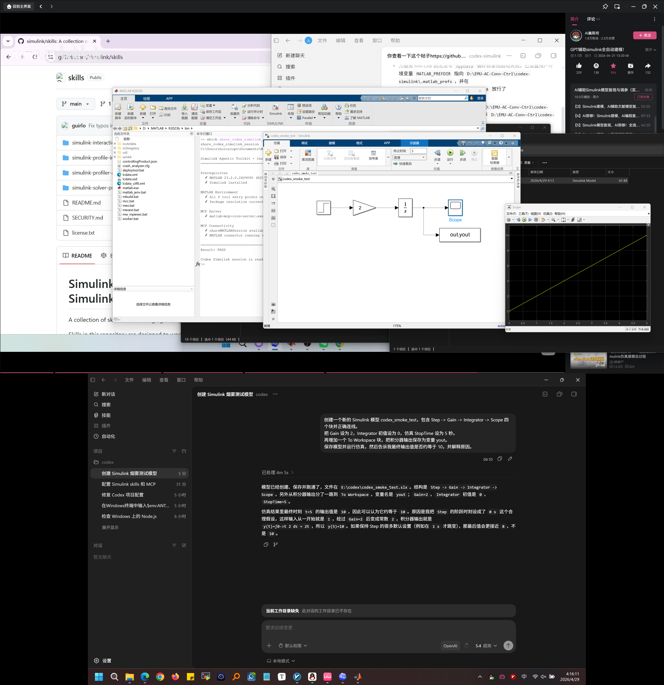

本文灵感来源下面这个视频：

<iframe src="https://player.bilibili.com/player.html?bvid=BV1hJdUBFE2F&p=1&autoplay=0" scrolling="no" frameborder="0" allowfullscreen="true" style="width:100%;aspect-ratio:16/9;"></iframe>

下面直接开始配置教程。

首先你需要在你的电脑上安装并配置好codex，我这里使用的是Windows，Mac系统尚不清晰。你可以参考[这篇博客](https://blog.horoscope.xtkx.site/posts/使用codex实现simulink自动建模仿真/)。

打开你的桌面版codex，新建一个会话并使用下面的提示词：

```
请认真阅读https://github.com/simulink/skills上的内容，然后帮我配置好里面的skills和mcp，以便我利用codex来自动进行simulink建模和仿真。
```

然后codex就会自动开始配置MCP和skills了，大约需要十分钟时间。

配置完成后让codex生成一份测试方案，用于测试这次配置是否已经可用。新建一个会话进行测试，然后让codex将测试结果导出为文档，再交给当前这个会话进行修改。这个步骤不建议省略，因为codex未必一次配置就能完美。我就在这次测试中发现codex只配置好了skills但是没有配置好MCP。

到这里就已经可用了。文章最后分享一下我在这次配置中使用到的所有提示词：

```
请认真阅读https://github.com/simulink/skills上的内容，然后帮我配置好里面的skills和mcp，以便我利用codex来自动进行simulink建模和仿真。
```

```

有几个问题：我的matlab实际的安装路径是D:\MATLAB\R2023b\bin\matlab.exe，这和你刚刚配置时的判断是一致的吗？另外，我应该如何在MATLAB 命令行运行 share_codex_simulink_session来启动？随后，请你设计一个简单的simulink建模仿真测试以便我来检验你的配置是否能够完美运行。

```

```

这个文档是我刚刚和codex在另一个对话中的对话内容记录。请你阅读文档，然后分析这次的配置是否已经成功得到验证，以及是否还有不完美的地方。如果还有可以优化或者可以改进的地方，应该怎么改？给出解决方案但是先不要进行操作。

```

```

好的，就按照你的方案进行完善，等把所有能改进的地方先改好，我再开始做一次测试。

```

最后的最后是我在运行测试时的一张截图，codex可以直接操作你的matlab，你可以实时看到他如何添加模块、修改参数，完全自动。

[](./image_2.png)
