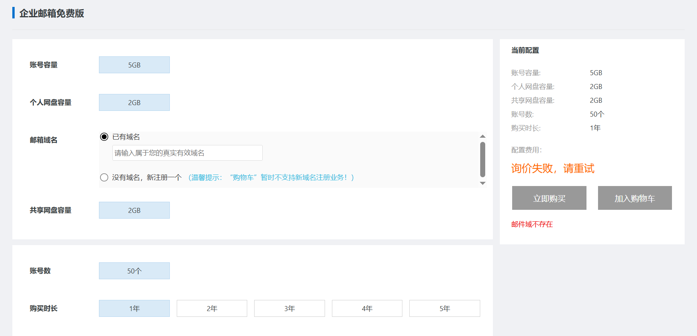
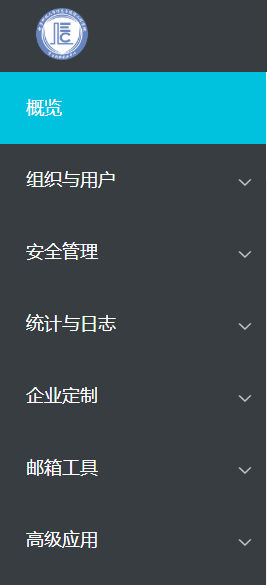

## 前言

今天突然想搭一个域名邮箱玩玩，手上的域名确实也比较多。域名邮箱顾名思义，就是用自己购买的域名作为后缀的电子邮箱，例如腾讯有@qq.com和@foxmail.com，网易有@163.com等，我购买了xtkx.site这个域名，那么我也可以搭建@xtkx.site这样的邮箱，这就是域名邮箱。

稍微研究了一下，大概有这样几种方案：

- 自购VPS+开源邮箱系统

- 直接购买邮箱服务，（类似于netcup的mail hosting套餐？）

- 直接使用云服务商的免费邮箱服务，例如cloudflare worker或者阿里云

最简单最容易上手的肯定是第三种了，其中cloudflare worker搭建的域名邮箱只能收不能发，阿里云则涉及到实名认证、绑定手机号这种强制性要求。

## 操作步骤

那就正式开始吧！这篇帖子就从门槛最低、免费的阿里云开始，我们使用的是阿里云企业邮箱免费版。（个人版已经在今年年初停止注册了）

首先我们需要在阿里云上买一个域名。一年期的域名最低在8元，十年期在249元上下，目前域名价格有上涨的趋势。考虑到域名续费都很贵所以后来我就只买十年期域名了。

购买域名之后我们就可以开通域名邮箱了，操作流程我参照的是[这篇帖子](https://blog.csdn.net/m0_53774040/article/details/135156596)。一个人有两个阿里云企业邮箱免费版的额度，但是一个账号只有一个，所以我用自己的账号上的xtkx.site这域名做的尝试。当然，这里还有一些前提，那就是你的阿里云账号和域名都已经经过了实名认证。

接着点开[企业邮箱免费版的申请页面](https://common-buy.aliyun.com/?commodityCode=alimail&userCode=a5fdv0ky&specCode=lx_18482#/buy)，这个入口藏得比较深，在企业邮箱首页是没法找到的。在申请页面选择我们账号上购买的域名就算正式开通了。

如图，企业邮箱免费版有很多限制，例如容量、账号数量等，由于1年和5年都是0元，所以直接选择5年就可以了，中途如果不想要了或者需要更换域名，都是可以直接操作的。

在这之后，我们需要进入控制台进行域名的解析，“设置解析”中有一键操作的按钮，非常方便。之后我们就可以使用mail+域名作为网址来访问我们的域名邮箱，但是一个明显的问题随之而来：使用mail+域名作为网址时，访问是http协议，也就是完全明文的。通过搜索 企业邮箱+SSL证书 我们可以了解到，为阿里云企业邮箱添加SSL的两个前提条件是：域名已经经过备案+企业邮箱不是免费版套餐。那么我们就可以直接放弃了。

我们继续选择使用~~qiye.aliyun.com~~[https://www.ali-exmail.cn/Land/](https://www.ali-exmail.cn/Land/)这个网址来作为我们邮箱的访问入口，管理员账户是postmaster@你的域名，需要设置初始密码并绑定手机号，后台有添加账号、SMTP等各种设置，功能丰富程度基本不比QQ邮箱逊色。

## 后记

经过我的测试，邮箱的收发都没有问题。由于服务器在阿里云，我们只是解析了域名，所以有关服务器稳定性的问题都不需要我们担心。稳定和省心也是这个方案的最大优势。当然也有一些代价，例如邮箱容量、账号数量，甚至是每一个账号都需要设置强密码和绑定手机号，在我看有一些减分。目前，我的个人博客是[horoscope.xtkx.site](http://horoscope.xtkx.site)，域名邮箱是[horoscope@xtkx.site](mailto:horoscope@xtkx.site)。下次我会尝试在自购的VPS上搭建域名邮箱，敬请期待。
