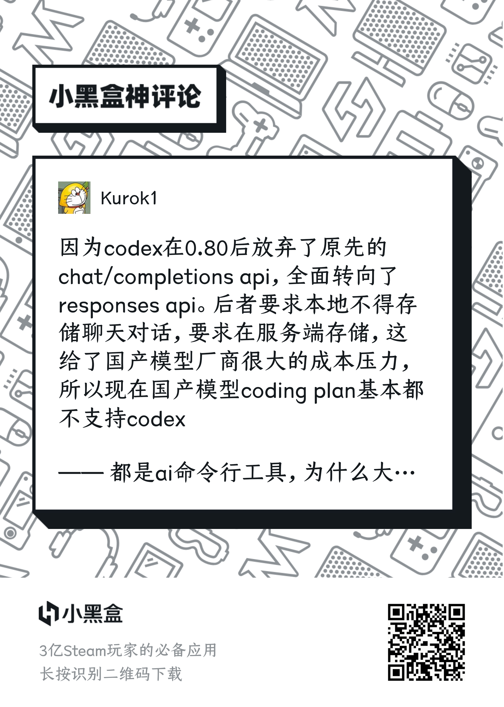
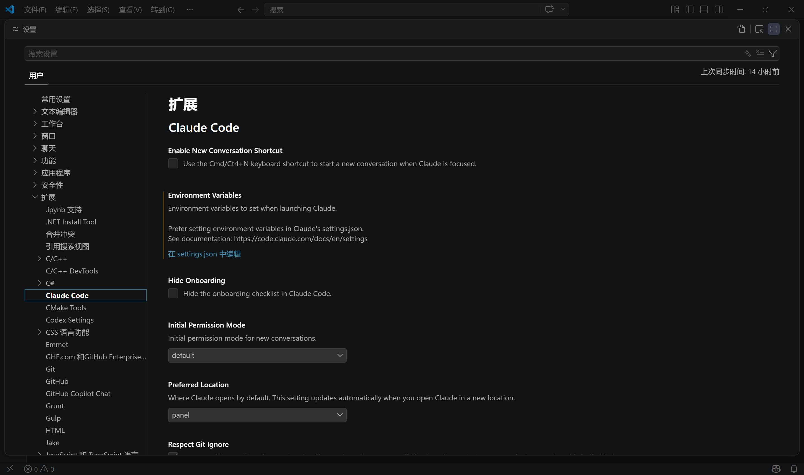

最近Deepseek-v4发布了，作为目前最强的开源模型，价格也是非常优惠，为了支持国产并体验新模型，故写一篇博客来记录如何使用官方开放平台的Deepseek-v4 API。

首先要说明的是，笔者目前还没有找到直接将官方开放平台创建的Deepseek-v4 API接入codex的方法，至少也需要使用中转站或者额外安装cc switch软件来实现，具体原因尚不清晰，只在网络上找到如下信息：



而Deepseek-v4 API接入Claude Code的办法在[Deepseek的官方文档](https://api-docs.deepseek.com/zh-cn/guides/agent_integrations/claude_code)中就已经说明，这也是本文写作的依据。

在开始使用Deepseek-v4 API之前，我们需要知道Deepseek-v4目前仍然不具备多模态能力，也无法自行实现联网搜索，如果有这方面的需求还是建议使用ChatGPT的API。

本文仅以CLI版本的Claude Code为例实现，不包含Windows和Mac的桌面版本。Linux系统的实现可以仿照CLI版本的方法。

## Claude Code的安装

首先在搜索中输入`cmd`以打开Windows的命令行窗口，接着确保已经安装Node.js、npm、git，可以用下面的命令来检查，若有版本号输出即为已安装。

```bash
node --version
npm --version
git --vrsion
```

然后用下面的命令安装Claude Code CLI：

```bash
npm install -g @anthropic-ai/claude-code
```

用下面的命令检查Claude Code CLI是否安装成功：

```bash
claude --version
```

之后直接在终端中输入`claude`命令即可启动Claude Code CLI。

## 接入Deepseek-v4 API

首次启动Claude Code CLI时，不可避免地需要登录账号。我这里尝试了很久跳过登录账号地方法（例如codex初次启动可以使用API密钥登录），但是都没有解决，最后不得不使用谷歌账号注册了一个新账号才能开始使用。下面列出一个在CSDN上看到地方法，读者可以自行尝试。

在`C:\Users\你的用户名`这个路径下找到名为`.claude.json`的文件，然后在文件中加入下面的参数，重启Claude Code CLI，看看登录是否已经被跳过。

```json
{
  "hasCompletedOnboarding": true
}
```

无论是修改文件跳过登录还是使用个人账号登录，接下来我们接入Deepseek-v4的API。

首先访问[Deepseek开放平台](https://platform.deepseek.com/)，充值余额并创建一个API密钥。

然后在`C:\Users\你的用户名\.claude`这个路径下找到`settings.json`，添加下面的参数：

```json
{
  "env": {
    "ANTHROPIC_AUTH_TOKEN": "你的API密钥",
    "ANTHROPIC_BASE_URL": "https://api.deepseek.com/anthropic",
    "ANTHROPIC_MODEL": "deepseek-v4-pro[1m]",
    "ANTHROPIC_DEFAULT_OPUS_MODEL": "deepseek-v4-pro[1m]",
    "ANTHROPIC_DEFAULT_SONNET_MODEL": "deepseek-v4-pro[1m]",
    "ANTHROPIC_DEFAULT_HAIKU_MODEL": "deepseek-v4-flash",
    "CLAUDE_CODE_SUBAGENT_MODEL": "deepseek-v4-flash",
    "CLAUDE_CODE_EFFORT_LEVEL": "max"
  }
}
```

注意这里API密钥需要替换为你刚刚创建的API密钥，其他参数尽可能不修改，尤其是`[1m]`，只有带上这个后缀才能开启Deepseek-v4的1M上下文功能。`"CLAUDE_CODE_EFFORT_LEVEL": "max"`这个参数则是对应思考模式，分为**默认、high、max**三种思考模式。

如果你刚刚是登录个人账号进入的Claude Code CLI，现在需要在一个新的终端窗口中使用`claude /logout`命令来退出账号，这样我们刚刚修改的配置文件才会开始生效。

在Claude Code CLI中询问”**你是什么模型？**”即可检查Deepseek-v4是否已经正确接入。

## 为Claude Code CLI安装插件

目前我还没有在codex上使用过插件（我还不知道codex有没有插件功能），但我已经看到很多Claude Code的插件被推荐。下面我以安装**Superpowers**插件为例来进行演示。

先启动Claude Code CLI，在对话框中输入：

```
/plugin install superpowers@claude-plugins-official
```

即可一键安装。插件的功能与使用方法详见[这篇博客](https://www.cnblogs.com/jinjiangongzuoshi/p/19863212)。

## 将Deepseek-v4 API接入VScode上的Claude Code插件

与codex不同，VScode上的Claude Code插件不会复用已安装的Claude Code CLI的配置文件。在我们安装好VScode的Claude Code插件后，按照以下步骤进行修改：

在VScode中使用`CTRL+，`快捷键打开设置，找到Claude Code，选择”**在setting.json中编辑**”。



在打开的配置文件中填写以下参数：

```json
[
  { "name": "ANTHROPIC_AUTH_TOKEN", "value": "你的API密钥" },
  {
    "name": "ANTHROPIC_BASE_URL",
    "value": "https://api.deepseek.com/anthropic"
  },
  { "name": "ANTHROPIC_MODEL", "value": "deepseek-v4-pro[1m]" },
  { "name": "ANTHROPIC_DEFAULT_OPUS_MODEL", "value": "deepseek-v4-pro[1m]" },
  { "name": "ANTHROPIC_DEFAULT_SONNET_MODEL", "value": "deepseek-v4-pro[1m]" },
  { "name": "ANTHROPIC_DEFAULT_HAIKU_MODEL", "value": "deepseek-v4-flash" },
  { "name": "CLAUDE_CODE_SUBAGENT_MODEL", "value": "deepseek-v4-flash" },
  { "name": "CLAUDE_CODE_EFFORT_LEVEL", "value": "max" }
]
```

记得把参数中的API密钥替换为你的API密钥，然后就可以在侧边栏中找到Claude Code插件进行检查了。
