这篇文章我将尽可能真实且毫无保留地记录我在2026年3月至5月期间投递暑期实习的经历，用于整理自己的投递历程，以及帮助可能需要它的读者。

# 投递背景

先介绍一下我的投递背景（太长可跳过）：

我是信息与通信工程学院网络工程的本科生，与硬件结缘来自于大一开学时加入信通科协，之后连续参加了2024年和2025年的电子设计竞赛。除此之外还参加或接触过嵌入式竞赛，大学生智能车竞赛，Robocon竞赛和大学生方程式竞赛。这些竞赛大部分都是浅尝辄止，鲜有获奖。但是加入科协和参加电子设计类竞赛让我有机会与很多优秀的学长学姐交流，并通过竞赛督促我学习和实践硬件知识。

由于均分低，我在大一下学期被分入网工专业，但是我的兴趣让我在硬件方向坚持下来。值得一提的是，如果不是网工的专业课难度低且绝大多数都是全开卷考试，我也没有更多课余时间参加竞赛，更没有机会在大三下学期5月份就外出实习。

# 投递过程

下面详细记录我的投递过程，一些印象深刻的面试会一并写上面经。以下内容中，公司按照**投递时间顺序**排列，岗位按照**志愿先后顺序**排列。

## OPPO-【硬件工程师】【PCB工程师】

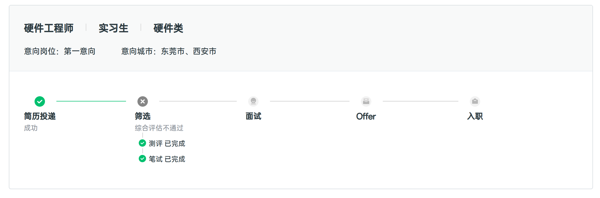

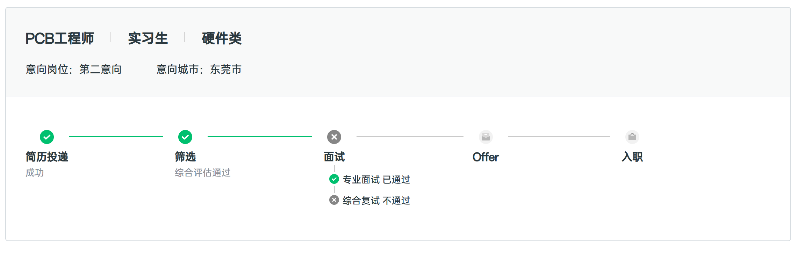

3月18日投递简历，3月20日邀请参加性格测试和线上笔试，一志愿笔试做得极差。笔试只有模电和数电的题目，比较贴合课本内容。有道题目是：已知 BJT 的三个引脚电压，判断材料是硅还是锗和NPN/PNP类型；模电有共集共射共基的区别，数电考了几种触发器的功能和区别，还考了线性电源和开关电源的特性与区别，另外还有一道关于 BJT 的大题，印象很深，是信通的“电子电路实验Ⅰ”的期末考试题，也不会做，所以一志愿的笔试就挂了。

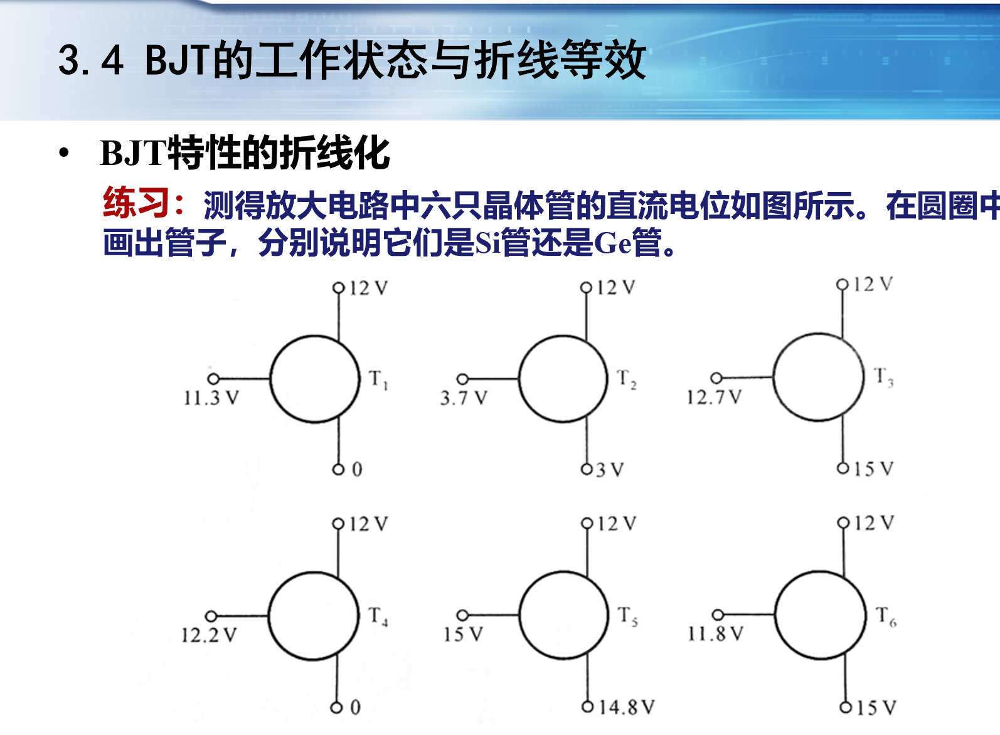

4月13日 OPPO 把我的二志愿又捞起来，约了一面；4月14日一面，问了10分钟简历上面的项目，还有10分钟问了对AI的看法。4月21日约二面；4月22日二面，简单问了下项目，问了为什么笔试做的很差，问了对岗位的看法，使用AI的能力，还有一二志愿更倾向于选择哪一个。我回答的是虽然一志愿已经挂了，但是还是更倾向于一志愿（这是因为当时已经签了offer所以这样回答）。之后一直没有消息，一直到5月中旬再去官网上看的时候已经挂了。

## VIVO-【硬件工程师（基带方向）】

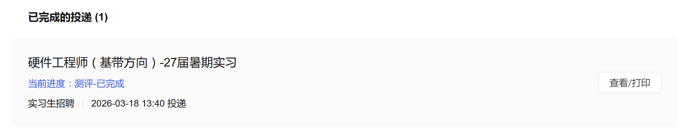

3月18日投递，3月19日邀请性格测试，性格测试的行测题目难度变态，拼尽全力无法战胜。之后再无后文，不清楚是性格测试挂还是简历挂。

## 联想-【电子/电路工程师】

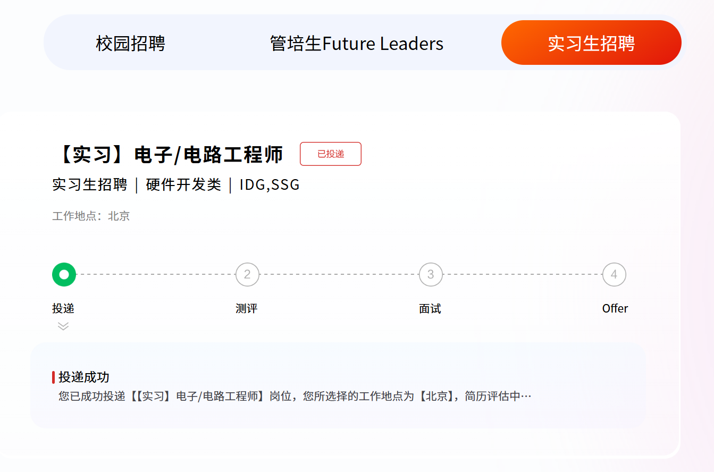

3月19日投递，5月6日发邮件通知挂了，无性格测试，无笔试无面试，直接简历挂。

## 华为-【硬件技术工程师-单板硬件】

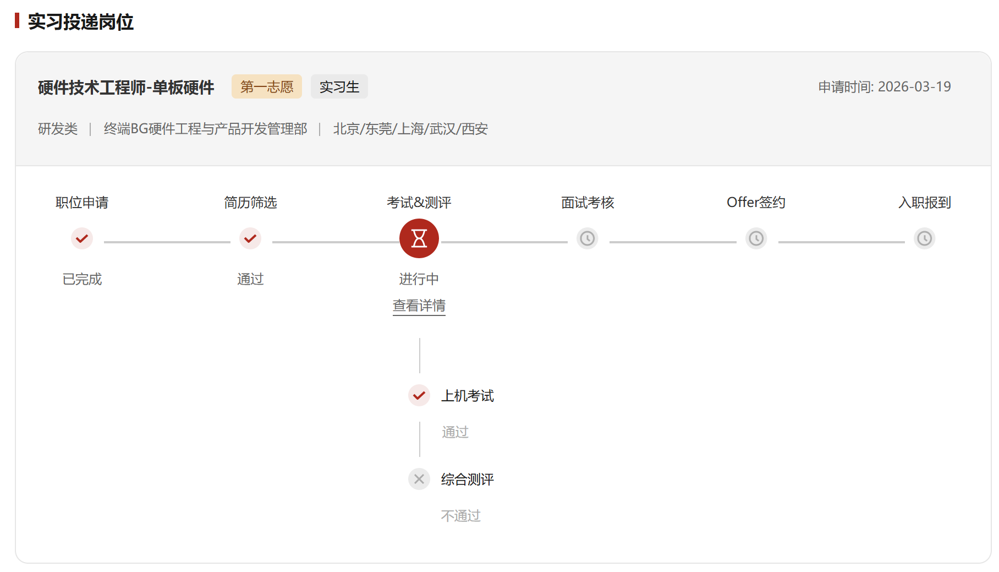

3月19日投递，4月7日发邮件要求签一个保密书，并且约了4月8日晚上7点-8点的线上笔试。华为的笔试时间是固定的，必须在它要求的时间段里面完成，并不像其他公司给1-2天的时间。4月7日同时邀请参加了性格测试，当天顺手就完成了。

4月8日按时参加了晚上的线上笔试，结果晚上10点的时候笔试结果还没出来，性格测试就已经挂了。之后笔试通过后问了HR，说以平台为准。之后再无后文。

华为是我投递的公司里面唯一一个以性格测评不通过挂掉我的。网上也有很多类似的情况，据说是因为测评的“一致性”不强，也就是对于类似的问题回答了两种截然相反的结果。如果你做过任何性格测评都能理解做着做着发现自己填写的结果和之前的题目有矛盾。不过也是没有办法。

## CVTE 视源股份-【嵌入式单板硬件工程师】

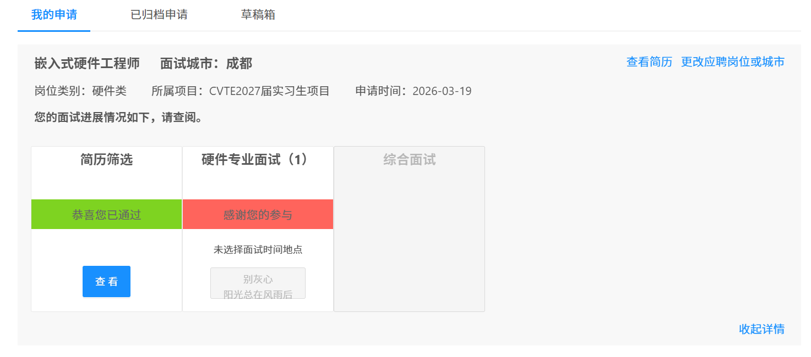

视源股份，或者更熟悉的名字是希沃白板。3月19日投递，3月22约面，无笔试无性格测试。3月25日驱车前往太古里的全季酒店参加线下面试。这也是我投递过程中第一次参加面试，也是唯一一次线下的面试。由于过度的紧张，前一晚都没怎么睡着。

到线下之后等了半个多小时才叫我进去，给了纸笔，问了三个问题。一个是使用单电源供电的运放放大一个没有直偏的交流信号，一个是boost升压电路拓扑，还有一个忘了。问题不算难但是都没答上来。面完等了几天都没有邮件，4月2日去官网看已经挂了。

## 安克创新-【硬件工程师实习生】【硬件测试工程师实习生】【电子硬件实习生】

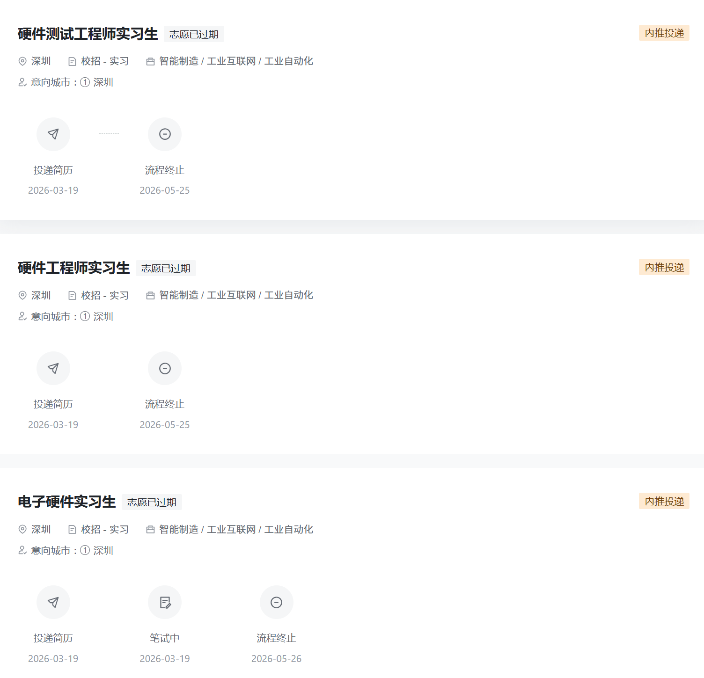

安克是做充电头和充电宝的公司，可以投递三个实习岗位。3月19日投递简历，当天就发测试链接了。第一项是普通的性格测试，第二项就很有意思，要求登录它提供的云电脑，在规定时间内，根据给定的资料完成一份产品展示网页。这个测试项目主要是为了考察使用AI工具的能力，但是你要一个硬件实习生做网页前端，实在是有点难评。做完这两个项目之后也是没有任何音讯，5月25日发邮件通知已挂。

## 智元机器人-【硬件实习生】

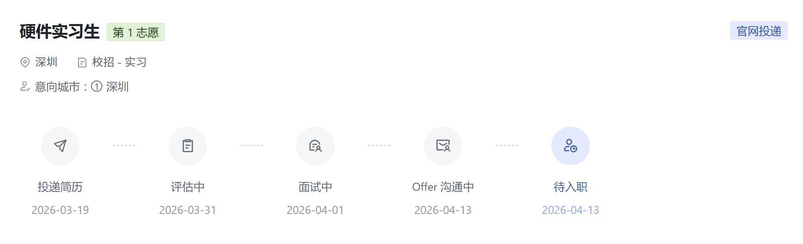

智元是成电人相对熟悉的公司，创始人是知名博主稚晖君。3月19日投递，4月1日约一面，4月2日一面，4月3日约二面，4月8日二面，4月9日offer call，4月13日发offer邮件。这也是我投递实习的唯一一份offer和最终去向。

一面面了很久，狠狠拷打了简历上的项目，内容有：

- 电感的额定电流和饱和电流的区别
- 舵机的反馈电路和控制电路的原理
- D类功放的原理

二面也是面了一个小时，依旧拷打项目，内容有：

- buck电路的损耗来源
- MOS的米勒平台
- SPI通信的几种模式

面试前一晚我就提醒自己复习一下米勒平台的内容，但是太晚了就直接睡了，结果没想到面试真的问到了。二面总体上答得不算很好，但是还好最后还是给了offer，可能是部门比较缺人吧。

这种拷打项目的面试其实都挺好的，至少问题都是从项目里面发散出来的，认真做了项目都不会答得太差。而且智元没有性格测试和线上笔试，不至于在这两个环节被挂掉。

## 中兴通讯-【硬件测试工程师】

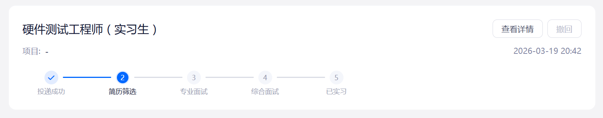

3月19日投递，杳无音讯。

## 欣旺达-【硬件开发工程师实习生】

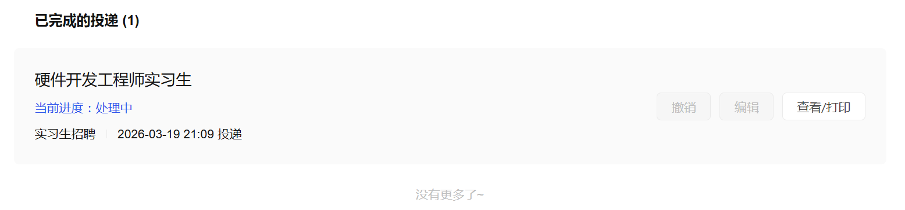

3月19日投递，杳无音讯。

## insta360-【硬件实习生】

3月23日投递，3月24日约一面，4月1日一面，4月3日邮件通知已挂。

最可惜的一家公司。一面体验很舒服，面试官的提问基本都能回答上来。内容也是主要拷打简历上的项目，但是没有很难或者很偏的问题（也有可能是单纯运气好），以及聊了一些团队协作方面的能力。一面结尾的提问环节谈到工作地点在深圳，我就说：深圳有很多高新技术企业，但是蚊虫很多且气候太热了，所以我不太喜欢。不知道是不是这句话导致面试官对我好感度降了一截，然后果断给我挂了。

## TI 德州仪器-【现场技术应用工程师实习生(模拟方向)/Analog FAE Intern】

大概是3月底投递的简历，直到7月3日才邮件通知被拒。这个结果属于意料之中，毕竟 TI 确实是门槛非常高的公司。

TI 的投递和其他公司有几个不同之处：首先，投递简历不需要注册账号，这也意味着你无法通过登录招聘系统查看当前的进展。其次，TI 的简历填写页面明确要求填写模电和数电两门课的成绩（虽然不确定他们会不会去核实）以及是否参加过电子设计竞赛、如果参加过取得了哪种奖项。对我来说，我的模电成绩刚刚及格，而电赛虽然参加过两次也只有第一次取得了省二，第二次参加更是连奖项都没拿到，所以因为这个被拒并不意外。

## 海康威视-【硬件设计工程师】【模拟硬件电路工程师】

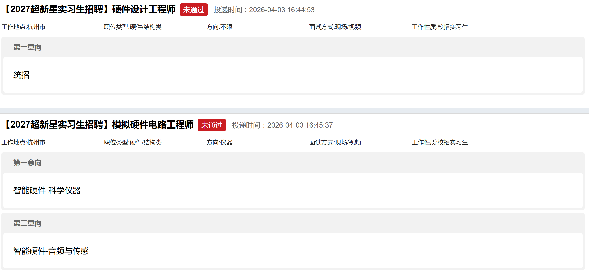

4月3日投递简历，当天发了性格测试的链接，4月9日邀请参加线上笔试。之后也是没有任何消息，4月底再去官网看的时候都挂了。

## 它石智航-【机器人电子硬件实习生】

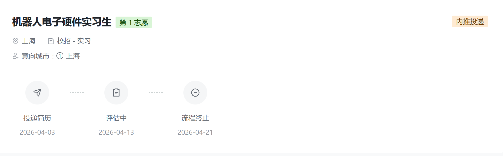

和智元一样，它石智航也是具身智能公司，是已经在里面实习的同学内推的。4月3日投递，没有笔试和面试，4月13日HR直接打电话来问我最快什么时候可以入职，因为他们的HC是先到先得的。HR还说如果下周这个HC还在的话会再和我联系，然后就没有然后了。4月21日系统上显示已终止。

## 小米-【硬件研发实习生】【硬件研发-车载电源硬件实习生】

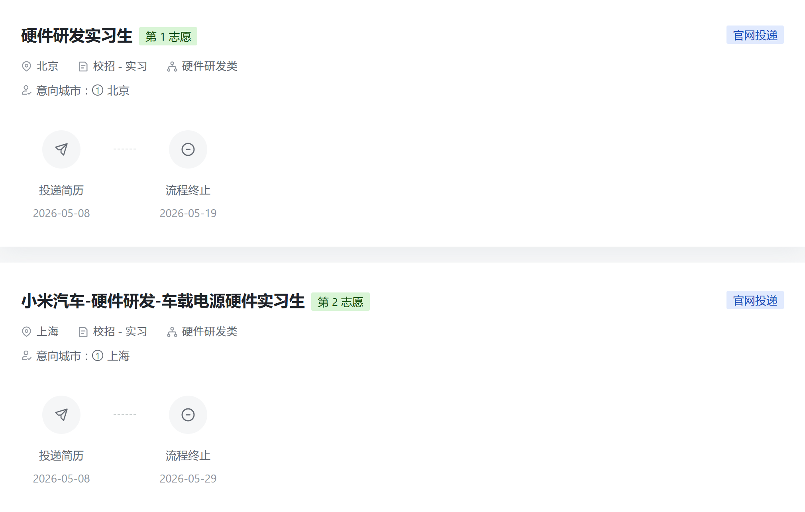

小米汽车的硬件岗位很多且种类非常丰富，加上在学校的方程式车队的参与过一小段时间，对汽车硬件有一定了解，本来是希望在面试时施展一番的。只可惜小米汽车的硬件实习岗位绝大多数都卡硕士学历，几乎投无可投，甚至连面试都没有进。

5月8日投递，没有任何消息，5月19日流程终止。

## 传音-【助理硬件工程师】

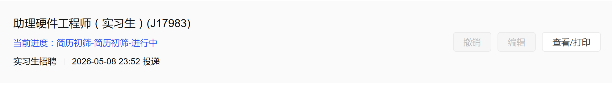

5月8日投递，无任何消息。

## 荣耀-【机器人硬件开发工程师】

荣耀是我在智元实习一段时间后投递的公司，主要看在荣耀和智元都在做人形机器人。5月9日投递简历，5月13日发笔试通知，5月14日在规定时间内完成笔试，5月18日约一面，5月22日一面，然后就挂了。荣耀的笔试题目没什么印象了，面试的时候由于我的简历上有一个机器人相关的项目，所以一直在挖这个项目的内容。恰好这个项目并不出彩且我也没有提前去准备，所以回答比较磕磕绊绊，有个问题是机器人上的音频通信方式回答的是I2C而实际上应该是I2S，面试官当时就点出了这个问题。

# 表格汇总

用 AI 工具整理了一个投递记录表，更直观一些：

| 公司       | 投递时间 | 性格测评 | 笔试    | 一面    | 二面    | 是否offer |
| ---------- | -------- | -------- | ------- | ------- | ------- | --------- |
| OPPO       | 3月18日  | 3月20日  | 3月20日 | 4月14日 | 4月22日 | ✗         |
| VIVO       | 3月18日  | 3月19日  | -       | -       | -       | ✗         |
| 联想       | 3月19日  | -        | -       | -       | -       | ✗         |
| 华为       | 3月19日  | 4月7日   | 4月8日  | -       | -       | ✗         |
| CVTE       | 3月19日  | -        | -       | 3月25日 | -       | ✗         |
| 安克创新   | 3月19日  | 3月19日  | 3月19日 | -       | -       | ✗         |
| 智元机器人 | 3月19日  | -        | -       | 4月2日  | 4月8日  | ✅ 4月9日 |
| 中兴通讯   | 3月19日  | -        | -       | -       | -       | ✗         |
| 欣旺达     | 3月19日  | -        | -       | -       | -       | ✗         |
| insta360   | 3月23日  | -        | -       | 4月1日  | -       | ✗         |
| TI         | 3月底    | -        | -       | -       | -       | ✗         |
| 海康威视   | 4月3日   | 4月3日   | 4月9日  | -       | -       | ✗         |
| 它石智航   | 4月3日   | -        | -       | -       | -       | ✗         |
| 小米       | 5月8日   | -        | -       | -       | -       | ✗         |
| 传音       | 5月8日   | -        | -       | -       | -       | ✗         |
| 荣耀       | 5月9日   | -        | 5月14日 | 5月22日 | -       | ✗         |

# 简历展示

没有科研经历，没有竞赛大奖，所以直接把参加竞赛做的作品当成项目经历来写。项目内容有美化的部分，尽管技术含量不算高，但是至少都是自己亲手做出来的。简历上的个人信息已裁剪掉。

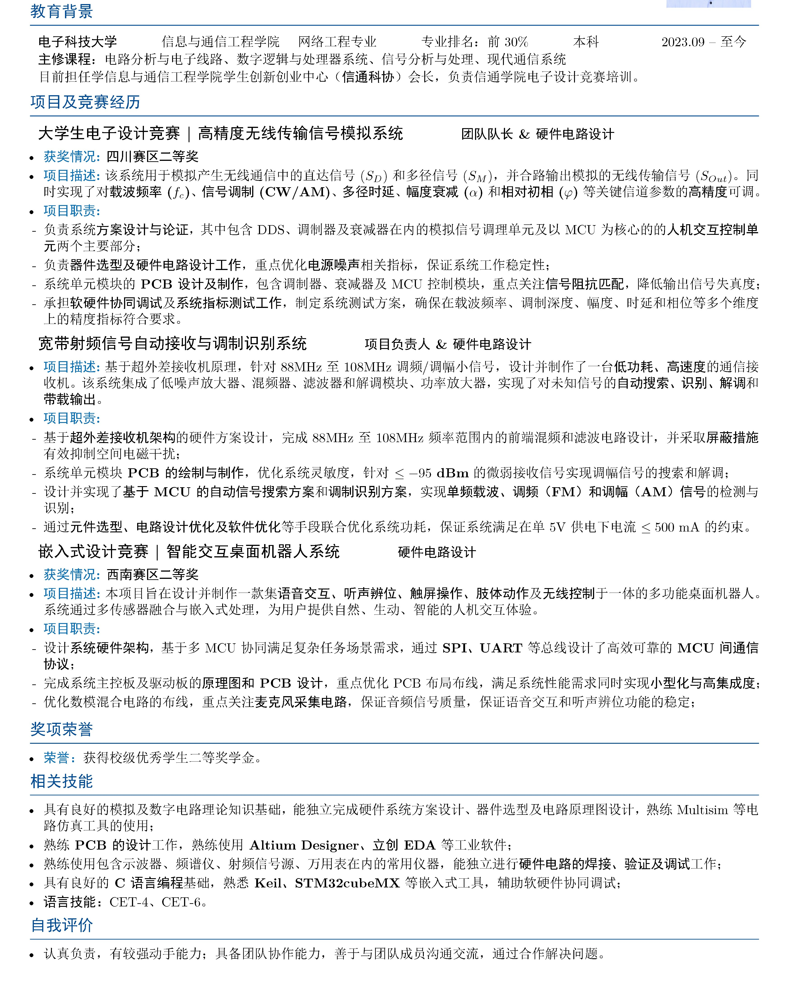

此处感谢一直帮我优化简历和支持我投递简历的朋友们。

# 面经示例

下面这些笔记是我在4月7日晚上给自己写的复习提纲，涵盖了之前多次面试中主要的考点。如果你也即将参加一场硬件岗位的面试，你也可以像这样在面试前临时补充和储备一些知识。

1. 运放的主要参数
2. 示波器补偿电容
3. 载波同步
4. 自举电容
5. 几种DCDC电路的拓扑
6. LDO工作原理
7. 恒流源、电流泵
8. 解调芯片的工作原理
9. VCO、锁相环
10. ADC/DAC结构分类与原理
11. A、B、D类功放原理
12. Buck电路的工作模式
13. Buck电路的环路补偿
14. 通信协议：SPI、CAN、I2C、UART
15. 电感饱和电流、额定电流；电容Q值、自谐振频率、直流偏置特性
16. 3W原则
17. 高速信号的布线规则
18. 硬件产品的开发流程
19. 信号链中信噪比计算公式--费里斯公式
20. LNA选型与参数
21. 电调的工作原理
22. 舵机的工作原理、电机的工作原理
23. MOS的米勒平台

# 总结与建议

1. 在投递简历和参与实习的这段时间我意识到，硬件岗位考察的很多知识和信通学院的专业课重合程度并不高，反而和电子学院、集电学院的一些专业课有重叠。信通的《信号与系统》《通信原理》这两门主要的专业课并不是面试的重点（射频岗位可能还是需要的），主要考察的还是模电、数电更底层的内容，以及电子学院的一部分电磁场知识和集电学院的一部分半物、微电子器件知识；网络工程的网路算法和网络协议和硬件岗位更是几乎不沾边。如果要投递硬件相关岗位，需要区分主次，找到正确的学习内容与方向。

2. 硬件岗位对于本科学历并不友好。我们常说本科就业可以“转码”，却几乎没有说“转硬”的，主要是本科学习的硬件知识少且浅薄，而硬件工程师需要非常广的知识面和丰富的实践经验。参加过电子设计类竞赛的同学在这个方面优势会大很多，很多书本上没有的知识和技能都是在竞赛中学会的。如果有机会，我也希望未来能够读个研究生，然后再出来找工作，可以投递的岗位就多很多了。

3. 没有突出的竞赛奖项，也没有数一数二的rank，更没有实习经历的情况下，项目经历是非常重要的。有时候我甚至会感觉，项目经历会比前面三者都要重要，深挖项目经历也是面试过程的主要内容，是面试官了解求职者水平的主要手段。所以如果竞赛没有突出的奖项，可以自己做一些有创新的、有难度的项目，专门用来在简历上展示个人能力，这样不至于只能写自己在竞赛中做过的项目和课设。

4. 对于投递过程中的建议，首先是可以专门练习一下性格测评，也就是我们常说的行测题。大厂（如OV、小米）的第一个环节就是性格测评，其中有一部分就是行测题目。我做行测题基本全程懵逼，没有思路，所以如果能专门练习一下，可以避免在行测环节被挂。如果因此错过了梦厂，那样就太过于可惜了。其次，面试结尾的提问环节也不能放松，如果对着面试官夸夸其谈，很容易言多必失（参考我的影石一面）。

5. 每年的3月开始学校会组织一些就业群（也有可能只是挂着学校的名字），里面有很多企业的校园大使发招聘信息，软件硬件的都有。如果不知道投递什么企业，可以多翻翻群里的消息，有合适的就投递。

6. 为了熟悉面试过程和积累面试经验，建议先投递小厂练手，然后再开始投递大厂。这样的好处是，小厂的进度一般推进较快，你可以很快了解到面试有哪些流程、面试官看到简历会问什么问题。下来之后再做对应的练习，比如练习行测或者补习一下面试没答上来的内容。AI 现在不仅写代码很厉害，硬件知识的也非常丰富。你可以把简历发给 AI 然后让它来充当你的面试官，在你回答完后进行点评，以帮助你改进你的回答。在投递的那段时间我经常这么做，这个方法也确实让我提前了解了自己的不足然后立刻去学习和补充。

7. 关于 AI 的看法，即使未来 AI 能取代相当多的工程师，但是取代硬件工程师的程度我认为还是要比取代软件工程师的程度要小很多的。在当下，AI 在理解电路上仍然存在不小的困难，况且它也没法代替人实际去操作和修改电路。加上我本身在代码领域没什么天赋，我就选择了走硬件这条路。
