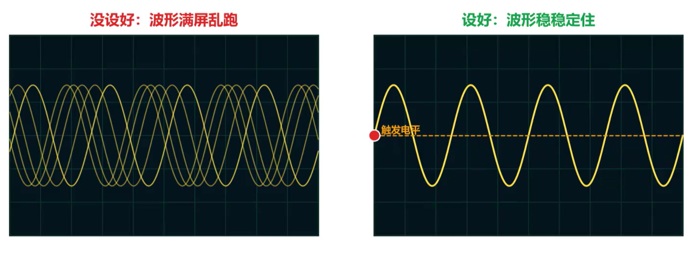
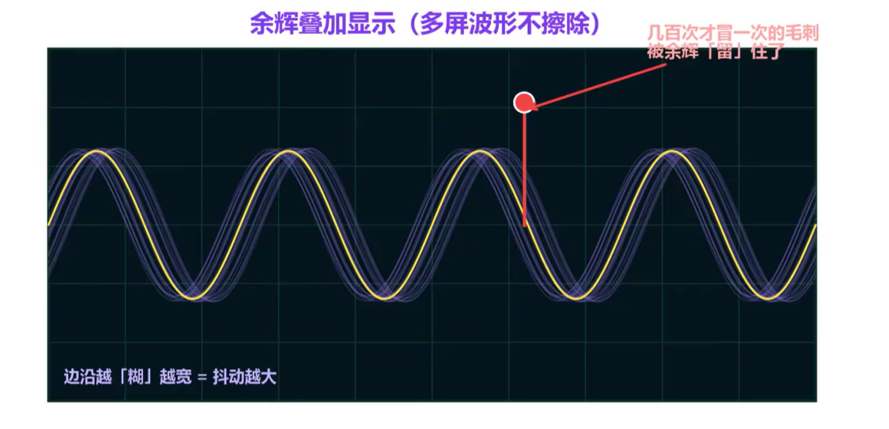

<iframe src="https://player.bilibili.com/player.html?bvid=BV11AJG6tEsb&p=1&autoplay=0" scrolling="no" frameborder="0" allowfullscreen="true" style="width:100%;aspect-ratio:16/9;"></iframe>

## 示波器设置方法

正确设置好示波器才能正确测出波形，只会 **Auto** 往往是不够的。
示波器的横轴表示时间：time/div表示每格多长时间；纵轴表示电压/电流，以电压为例，volts/div表示每格多少电压

示波器的核心只有五个旋钮：

1. **耦合（Coupling）**
   - 直流耦合：信号进来是什么样就显示什么样
   - 交流耦合：隔开信号的直流分量，只看交流分量
   - 接地耦合：将信号接地，也就是什么都测不到

2. **带宽（Bandwidth）**

   带宽表示示波器能采集到的频域范围，通常要求示波器带宽≥待测信号最高频率的3~5倍。示波器默认为全带宽，测量高频信号时可以使用；20M带宽限制用于滤除高频噪声，如测量电源纹波时使用。更高级的示波器可以自定义带宽限制。

3. **触发（Trigger）**

   
   触发没设好，信号会在屏幕上乱跑；触发设定好，信号才能稳定显示在屏幕上。通常把信号触发电平设置在信号幅度中间。

4. **采样率（Sample Rate）**

   采样率决定了波形画得细不细。根据奈奎斯特采样定理，采样率太低容易产生信号混叠，显示出完全错误的波形。通常要求采样率是信号频率的5倍以上。

5. **余晖（Persistence）**

   
   余晖功能可以让信号不立刻消失，而是在屏幕上慢慢淡出。很多个周期的波形叠在一起，专门用来捕捉偶发问题。余晖的波形堆叠得越宽，说明不同周期的信号波形抖动得越厉害，这一点和眼图的测试原理是一样的。

## 示波器品牌参考

| 国际品牌                             | 国产品牌       |
| ------------------------------------ | -------------- |
| Keysight 是德科技（原 Agilent / HP） | Rigol 普源精电 |
| Tektronix 泰克                       | Siglent 鼎阳   |
| Rohde & Schwarz 罗德与施瓦茨（R&S）  | Micsig 麦科信  |
| Teledyne LeCroy 力科                 | UNI-T 优利德   |

选型参考：入门最常见的是 **Rigol DS1054Z**；实验室或产线的中高端设备常见 **Tektronix MSO**、**Keysight InfiniiVision** 系列。
