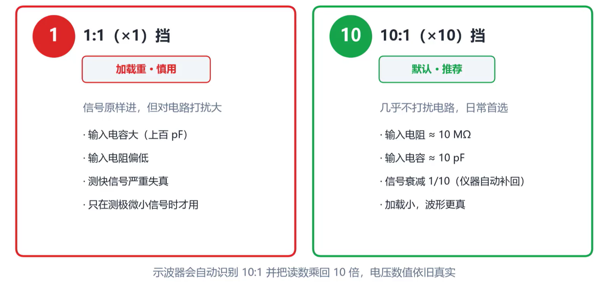
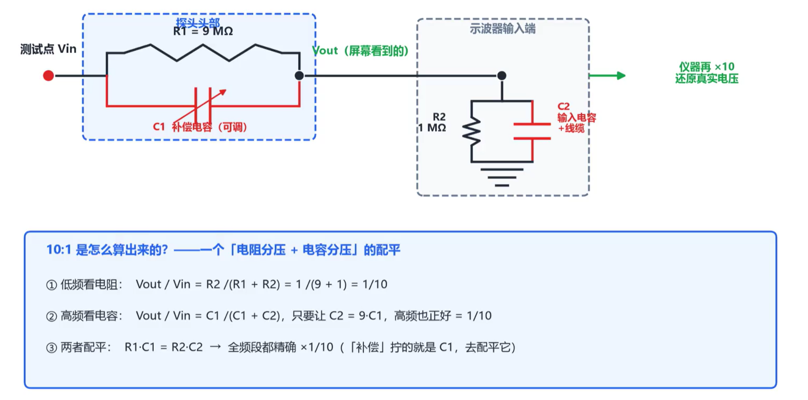
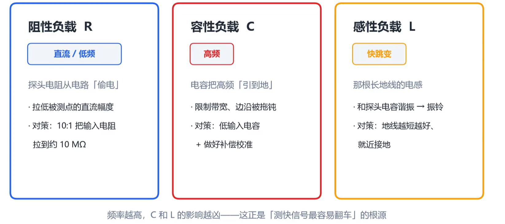
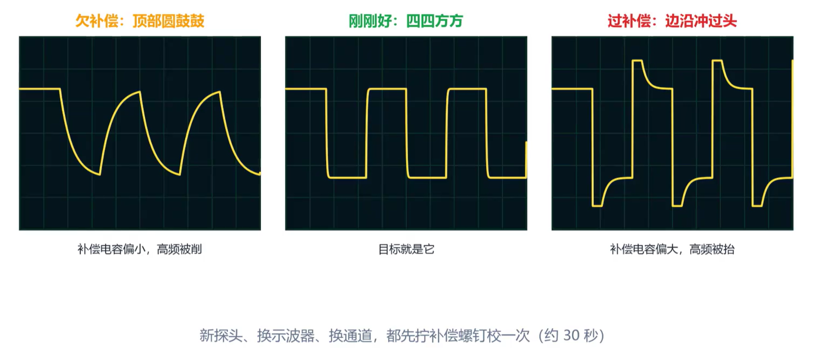
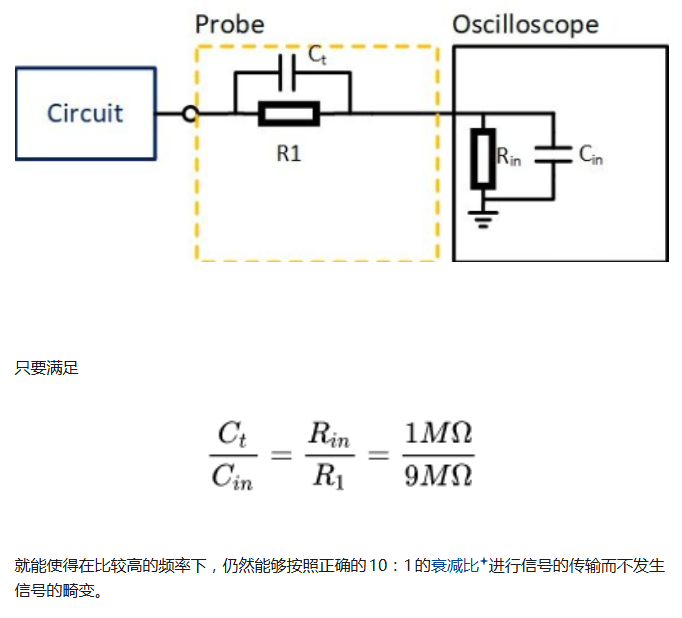

<iframe src="https://player.bilibili.com/player.html?bvid=BV1iKjK6nEP8&p=1&autoplay=0" scrolling="no" frameborder="0" allowfullscreen="true" style="width:100%;aspect-ratio:16/9;"></iframe>

## 探头加载

实际使用的探头不是理想的，探头尖端等效于**一个电阻+一个电容**。探头一搭在电路中，电路中原本的信号就已经被改变了，这就是探头加载。也就是说，测量本身已经干扰了被测对象。当探头被接入到电路中时，高频信号会直接从电容流向地，而无法被示波器捕捉到。

另一个事实是，探头也有反应极限。一个500MHz带宽的探头，上升时间大约700皮秒(ps)。测量系统的带宽受限于示波器带宽和探头带宽之间的较小值。

## 1X与10X挡位

相信你已经注意到，探头手柄处有1X和10X挡位的选择开关。10X挡位下，探头输入电阻更大，输入电容更小，示波器得到的信号幅值只有原来的十分之一（示波器会在读数界面自动乘10以还原信号幅值）。这样一来，相当于牺牲了信号幅值的测量精度，换取更大的测量带宽。

对于没有挡位选择的探头，通常已经默认调整为10X挡位。请务必注意：**示波器的挡位必须和探头挡位匹配**。当探头设置在10X挡位时，示波器也必须调整到10X挡位，否则测量的波形会衰减为十分之一。

因此，只有测量幅值很小的微弱信号时才使用1X挡位（因为10X挡位会将信号衰减到难以测量的程度），其他情况都推荐使用10X挡位进行测量。

## 探头等效电路

在探头等效电路中，保持探头内部电阻与示波器输入端电阻之比等于探头内部电容与示波器输入端电容之比，即可保证进入示波器的波形不会因为探头接入而失真。关于这部分内容，详见下方的【补偿电容与探头校准】章节。

## 三类负载与对策

探头接入电路后会产生三类负载效应，分别是电阻负载、电容负载和电感负载。下图展示了这三类负载的产生原因及相应的对策：

## 补偿电容与探头校准

示波器本体上通常有探头校准口，把探头夹在校准口，应当看到较为完美的方波信号。如果不是标准的方波，则出现了欠补偿或过补偿。上图分别是三种情况的波形示意图：直角变圆角是欠补偿，补偿电容偏小；有过冲是过补偿，补偿电容偏大。

**补充：强烈推荐阅读[这篇知乎文章](https://zhuanlan.zhihu.com/p/112485526)，里面有补偿电容的详细讲解。**

补偿电容源于示波器BNC接口处内部信号线与外围屏蔽层之间的寄生电容，这个电容是物理存在的，无法消除。为了减少这个电容对高频信号的影响，才出现了探头上的补偿电容。

探头上的补偿电容一般设置在手柄或与示波器连接的BNC接口处，可使用小型一字螺丝刀进行调节，以校准探头的频率响应。

## 常见探头类型

| 探头类型 | 功能                                                                | 描述                                                 | 注意事项                         |
| -------- | ------------------------------------------------------------------- | ---------------------------------------------------- | -------------------------------- |
| 无源探头 | 日常标配，通常使用 10X 挡位，带宽可达数百 MHz                       | 测量电压                                             | 使用前先完成探头补偿，并正确接地 |
| 有源探头 | 适合高速、高频信号，负载效应极小；尖端内置放大器，输入电容仅约 1 pF | 测量高速、高频信号                                   | 性能强但价格高，而且怕静电       |
| 差分探头 | 浮动测量，无需公共地，专用于测量差分信号                            | 测量两点之间的电压差；常用于电机、开关电源器件两端   | —                                |
| 电流探头 | 无需接触导线即可测量电流                                            | 夹住导线，利用磁场测量电流；可观察电流大小及有无浪涌 | —                                |
