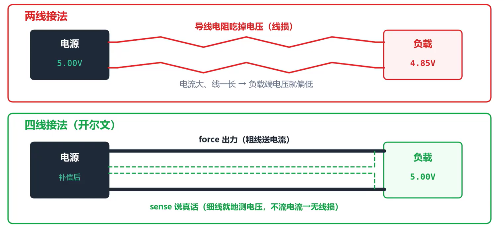

## 测试仪器介绍

除了示波器，测试工程师还需要熟悉以下几种测试仪器的使用：

- **万用表** - 测量电压、电流、电阻及通断
- **直流电源** - 为被测电路供电
- **电子负载仪** - 模拟负载，测试电源性能
- **信号源** - 提供各种测试信号

## 万用表

万用表能测电压、电流、电阻，还能测量电路通断——检测到两点导通时会发出”滴”一声提示音。

测量信号有效值时，请认准 **True RMS**（真有效值），它按真实波形而非假设的正弦波来估算，测量结果更准确。

**接线注意事项：**

- 测电压：万用表需要和待测电路**并联**
- 测电流：万用表需要和待测电路**串联**
- ⚠️ 如果误用电流挡测电压，轻则烧保险，重则损坏仪表

## 直流电源

直流电源可以设置为三种工作模式：

- **恒压模式**：输出电压恒定，电流随负载变化
- **恒流模式**：输出电流恒定，电压随负载变化
- **恒压恒流模式**：哪个指标先达到上限，就以哪个指标为准

电路板测试时，可以先设定恒压模式，预估电流大小，把限流设置为稍微高出工作电流。这样当电路意外短路时，限流会拉低电压，保护电路板不被烧穿。

此外，精密测量时还需要考虑**线损**，也就是导线电阻消耗的电压。例如，电源供电5V，到板子上测量却只有4.8V，这就说明供电导线上消耗了0.2V电压。为了提高测量精度，可以采用**四线开尔文接线法**：细线测电压，粗线输送电流，减小线阻带来的损耗。

## 电子负载仪

电子负载仪是专门用来耗电的设备，可以模拟各种类型的电路负载。

电子负载仪有四种工作模式：

- **恒流模式**：保持电流恒定
- **恒压模式**：保持电压恒定
- **恒阻模式**：模拟固定电阻
- **恒功率模式**：保持功率恒定

> 例如测试直流电源是否稳定，可以设置恒流模式，逐步加大电流，看电压是否出现跌落。带载能力差的电源，电流增大时电压会随之下降；若电源突然关断，说明触发了过流保护。

补充：在测量大信号完整性/负载阶跃时，还可以把电子负载仪设置为 transfer 模式，输入起始负载电流、终止负载电流、阶跃速度（A/μs）、变化频率、占空比等参数即可模拟负载电流的快速跳变，以便测试直流电源应对负载阶跃的稳定性。

## 信号源

信号源可以输出多种波形信号：

- **基本波形**：正弦波、方波、三角波等
- **调制信号**：AM、FM 等调制类型
- **扫频信号**：频率随时间变化的信号

> **常见问题：** 如果信号源设置 1V 峰峰值，但示波器显示 2V，这是因为信号源默认输出阻抗为 50Ω，默认负载也为 50Ω，会把输出信号调成两倍，使负载上的信号达到设定值。但如果示波器的输入阻抗设置为高阻（1MΩ），2V 峰峰值就会原封不动加在示波器上，测出来的结果就是设定值的两倍。
>
> **解决办法：** 将信号源的输出阻抗设置为高阻模式即可。
