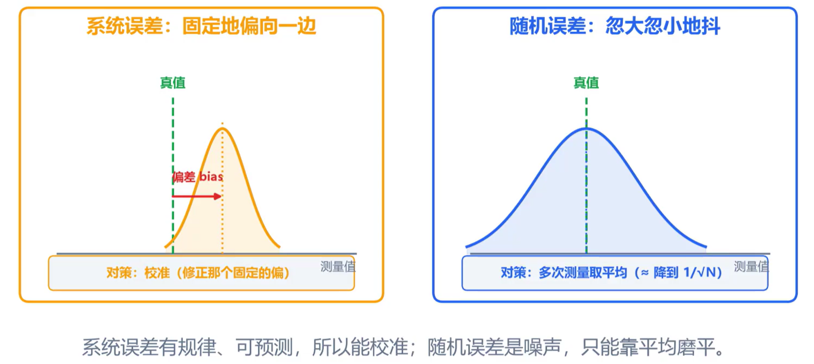
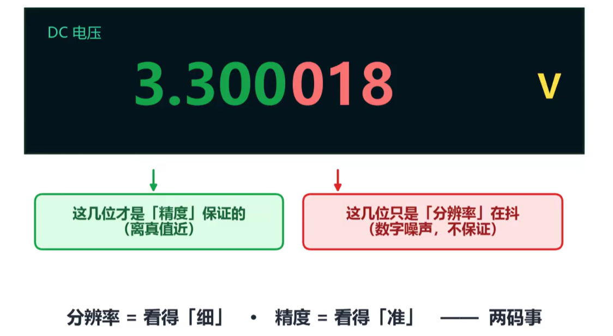

同一个电路，两只万用表测出来的结果不一样，该相信哪个？要回答这个问题，需要先理解几个关键概念。

## 准确度与稳定度

- **准确度**：指测量值距离真实值的误差大小，距离越小越准确。
- **稳定度**：指多次测量值的变化大小，测量值越集中稳定度越高。

理想情况下，万用表测量值**又准又稳**；测量值稳但不准，说明有**系统误差**；测量值准但不稳，说明有**随机误差**；测量值既不准又不稳，说明该修表了。

存在 **系统误差** 时，需要校准测量仪器；存在 **随机误差** 时，可以多次测量取平均值来减小其影响。

## 分辨率与精度

- **分辨率**：指表能显示到多细，即能识别的最小变化量。
- **精度**：指读数离真实值有多近，反映测量的准确程度。

仪器只能保证精度位数内的测量值，精度位数以外的测量值只能当作数字噪声。

如何判断万用表的有效精度？ **看使用手册。** 万用表精度是指仪表显示值与被测信号实际值之间的最大允许误差，通常以 `±（百分比读数 + 固定字）` 表示：

> 测量真实值 = 仪表读数 ±（读数误差 × 读数 + 量程误差 × 该量程下的分辨率）

**测量技巧**：在量程允许范围内，选择更小的量程可以获得更高的精度。

更多讲解可以阅读[这篇知乎文章](https://zhuanlan.zhihu.com/p/590936169)。

## 仪器校准

对于测量仪器，一般以 **一年** 为周期进行校准。校准的逻辑是一条"溯源链"：用更高等级的仪器来评判当前仪器，而更高等级的仪器又被再高一级的仪器校准，逐级溯源。

> 过期未校的数据，严格来说不能作数。
