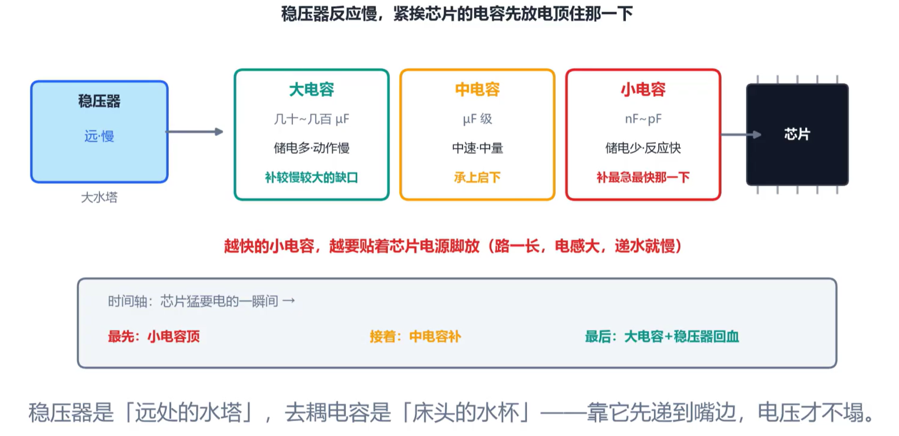

电路板上，供电输入端电压平稳不波动，芯片供电管脚处电压却波动剧烈，甚至产生严重塌陷——这就是**电源完整性**（Power Integrity, PI）的研究范畴。

## 瞬态电流与路径阻抗

芯片所需电流不是恒定的，**瞬态电流** 会波动，这就需要评估电源能否及时供电。

从电路板的供电入口到芯片管脚，路径阻抗包括电阻 R 和电感 L，掉压公式为：

> **ΔV = I × R + L × di/dt**

其中电感项通常起主要作用。

## PDN 电源分配网络

PDN（Power Distribution Network，电源分配网络）的供电路径如下：

- **源头**：VRM（电压调节模块）/ LDO（低压差线性稳压器）
- **路径**：电阻 R + 电感 L
- **储能电容**：去耦电容群，就近补电
- **终点**：芯片管脚，即芯片实际得到的供电

## 供电评估标准

供电不良有三种典型现象：

- **纹波（Ripple）**：来自于开关电源
- **压降（Drop）**：来自于负载突变、电源响应慢
- **噪声（Noise）**：布局布线和接地没做好

在芯片管脚处放置电容可以补救电压塌陷。负载电流突然增大时，电源来不及反应，去耦电容储存的电荷可以快速进行补给。

关于电容的选择与放置：

- **小电容** 更靠近芯片管脚，响应最快
- **大电容** 容量大，但响应较慢
- 电容必须尽可能紧挨供电管脚，路径过长时，寄生电感增大，响应速度会变慢

## 电源测量

测量电源时，最容易出错的就是**测量方法本身**。

推荐的测量设置：

- 示波器设置为 **AC 交流耦合**
- 开启 **20MHz 带宽限制**
- 使用**接地弹簧**（而非接地夹），接地弹簧需要紧挨芯片旁的地，以减少空间干扰带来的噪声。
