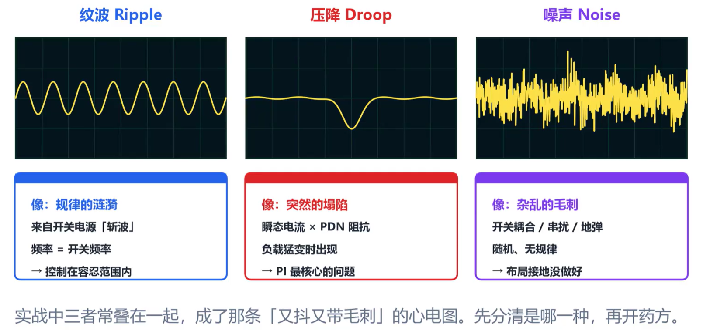

## 路径阻抗类型

从去耦电容到供电管脚看起来很短，但是到芯片真正的die还有很大一段距离。供电路径的阻力有三类：电阻R、电容C、电感L。把每个频率的总阻力画成曲线，就是PDN的阻抗曲线。提高供电质量，就是要降低供电路径上的阻抗。

阻抗多小才满足供电要求？这个值可以用公式来计算：最大路径阻抗=允许电压波动/最大电流冲击。

## 利用电容降低路径阻抗

为了降低供电路径上的阻抗，仅仅放置电容还不够。这是因为电容具有寄生电感，在高频时电感占主导，频率越高阻抗越大。因此必须多放置不同容值的电容，路径阻抗等于所有电容频率特性曲线最下面的那条。

## 电容自谐振频率SRF

电容SRF是指电容器的容性阻抗与其寄生电感的感性阻抗相等时的频率点，此时电容器表现为最小阻抗，超过该频率后电容器呈感性特性。

### SRF的定义与原理

电容器在理想情况下，阻抗随频率升高而下降，但实际电容器（如MLCC）存在寄生电感（ESL）和寄生电阻（ESR），导致在某一频率下，电容的容抗与寄生电感的感抗相等，这个频率即为自谐振频率（SRF）。其计算公式为：

`f_SRF = 1 / (2π√(L × C))`

在SRF点，电容器阻抗最小，表现为带通滤波器的中心点；频率超过SRF后，电容器的行为转为感性，滤波效果下降。

### 影响因素

- **寄生电感（ESL）**：封装尺寸越大或引线越长，寄生电感越大，SRF越低。0805封装的MLCC寄生电感约为5nH，而1206或更大尺寸的电容SRF通常更低。
- **等效串联电阻（ESR）**：ESR影响并联电容组合的阻抗曲线，过低或不匹配可能导致反谐振峰值，影响高频旁路效果。
- **电容值**：电容值越大，SRF通常越低，因为寄生电感与电容值共同决定谐振频率。

### 测量方法

常用的SRF测量方法包括：

- **网络分析仪法**：通过S11参数扫描阻抗曲线，精度高，适合1MHz–6GHz频段。
- **阻抗分析仪法**：使用四端对探头直接读取阻抗-频率曲线，操作简便，覆盖宽频段。
- **谐振电路法**：将电容与已知电感组成谐振电路，通过谐振频率计算SRF。

## 反谐振

摆放好不同容值的电容有时候也会起到反效果。在高频电路中，常用多只电容并联以覆盖宽频段，但不同电容的ESL和ESR不匹配时，会产生反谐振。如果在某一特定频率下，大电容呈现感性，小电容呈现容性，那么这两个电容就会形成LC谐振，导致路径阻抗在这个频率点出现尖峰，超出目标阻抗红线。

## 测量PDN阻抗曲线

1. **建模+仿真**：通过软件计算出整条阻抗曲线，适合设计阶段的预评估。
2. **矢量网络分析仪（VNA）实测**：探头尽可能靠近芯片，甚至探到BGA焊球下方，获取实际阻抗数据。
