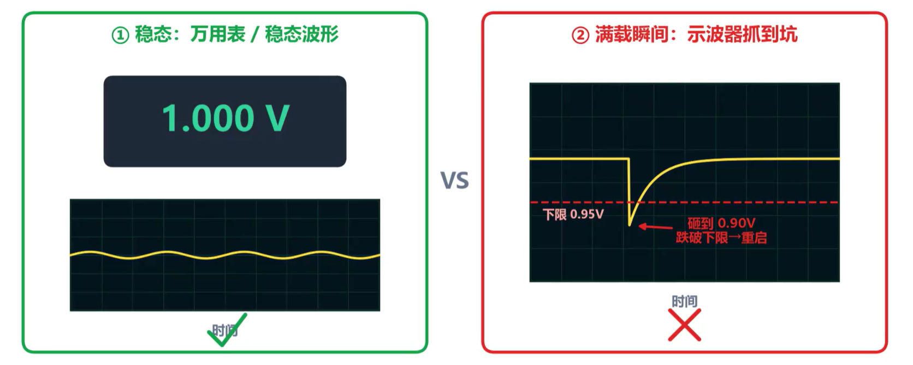
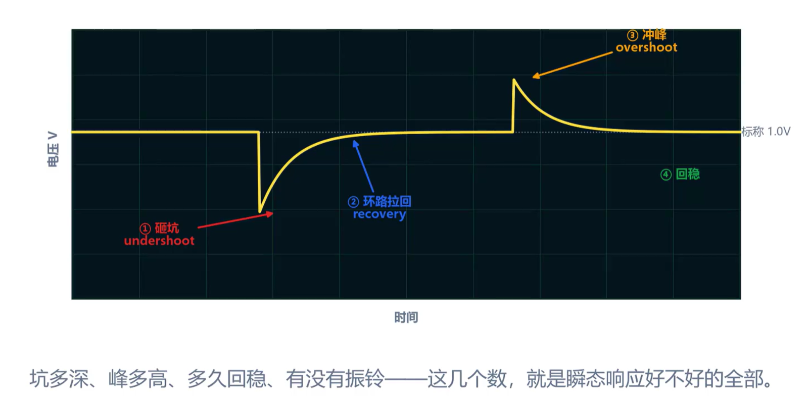

## 瞬态响应的概念

负载突然增大的瞬间，供电电压往往会出现跌落，这就是**瞬态响应**现象。万用表测的是**稳态直流电压**，只会在几毫秒甚至更长时间内取平均值，瞬间的电压跌落被平滑掉了；而芯片工作时电流不是恒定的，待机可能只消耗 0.5 A，满载可能瞬间跳到 10 A，这种电流在极短时间内从低跳高的变化称为**负载阶跃**（load step），**电流上升速率（Rise Rate）**的单位为 mA/μs 或 A/μs，反映电路中电流变化的快慢程度。

负载突变时，电压波形经历四个阶段：

1. **下冲（undershoot）**：负载电流突然增大，稳压器的反馈环路有延迟，电压还未来得及调节，出现跌落。
2. **环路追赶**：反馈环路检测到电压下降，开始增大输出电流。
3. **过冲（overshoot）**：环路追上后，电流又突然卸载，电压冲出一个峰。
4. **回稳**：电压逐渐回到标称值。

### 输出电容的作用

在稳压器环路响应之前的那几微秒里，由**输出电容**通过放电提供瞬时电流。电容放电过程中其两端电压随之下降，形成下冲。电容值越大，相同负载电流下电压跌落速率越慢，下冲幅度越小。

## 瞬态响应 ≠ IR Drop ≠ PDN 阻抗

这三个概念都涉及电源电压下降，但本质不同：

| 概念                    | 性质     | 测量域       | 描述                                         |
| ----------------------- | -------- | ------------ | -------------------------------------------- |
| IR Drop                 | 稳态直流 | 时域（直流） | 供电路径电阻上的压降，电流越大压降越大       |
| PDN（电源分配网络）阻抗 | 频域特性 | 频域         | 高频阻抗，决定电源在不同频率下的表现         |
| 瞬态响应                | 动态过程 | 时域（瞬态） | 稳压器对一次负载突变的反应速度和电压波动幅度 |

IR Drop 是电流稳定时路径电阻分掉的电压，稳态问题；PDN 从频域角度看高频阻抗；瞬态响应则关注负载突变那一刻，稳压器能不能跟上。

## 测试方法

### 模拟负载突变

使用电子负载的**动态模式**（dynamic mode），设置两个电流水平（如 1 A 和 10 A）以及电流变化速率，模拟芯片从待机到满载的跳变。

### 采集波形

用示波器在**芯片最近处**（芯片电源引脚或最近的去耦电容焊盘）测量，采用 **AC 耦合**方式并适当放大。AC 耦合可以滤掉直流分量，只显示交流波动，便于观察微小的电压变化。

## 判定标准

- **下冲深度**：不跌破芯片容差窗口下限（如 1.0 V ±5% → 不低于 0.95 V）
- **过冲高度**：不突破芯片容差窗口上限（如不超过 1.05 V）
- **回稳时间**：越短越好，满足芯片规格要求
- **阻尼特性**：不能来回振荡、振铃，必须单调收敛

以上四项任意一项不满足，芯片都可能在负载突变时出错。

## 优化措施

| 问题               | 对策           | 说明                                       |
| ------------------ | -------------- | ------------------------------------------ |
| 下冲太深           | 加输出电容     | 增大电容容量，为环路响应争取更多时间       |
| 环路太慢           | 改补偿、提带宽 | 优化稳压器的反馈补偿网络，加快环路响应速度 |
| 稳压器本身性能不足 | 换更好的稳压器 | 选择瞬态响应性能更强的型号                 |

### DC-DC 与 LDO 的选择

- **大电流场景要效率**：使用 DC-DC 开关稳压器，但必须配足输出电容来应对瞬态需求。
- **小电流场景要干净**：LDO 的响应速度快、输出纹波小，适合对噪声敏感的供电。
