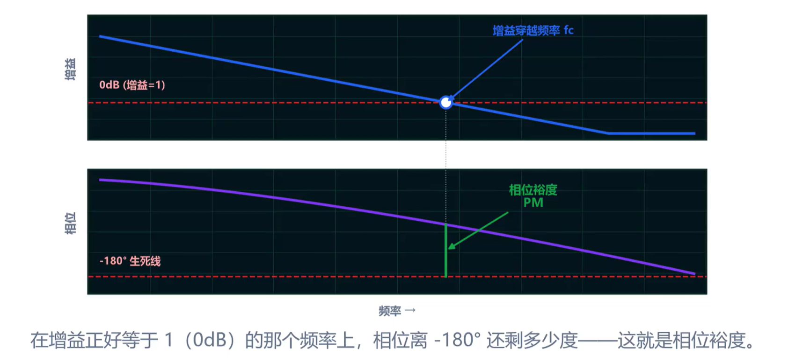
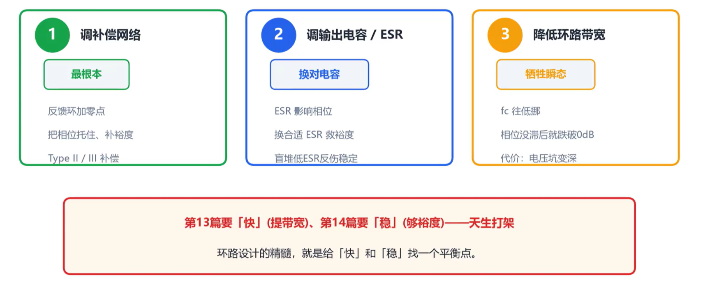

## 环路振荡的现象

稳压器的每个元件单独测量均正常，但上电后输出电压在示波器上持续抖动，电感可能伴随可闻的啸叫。这不是单个元件故障，而是由所有元件构成的**反馈环路**整体失稳——稳压器变成了振荡器。

## 环路振荡的原因

稳压器依靠**负反馈**工作：检测输出电压偏差后，调节占空比使输出回归目标值。当环路中存在**相位延迟**，且在某一频率处总相移达到 180° 时，负反馈变为正反馈。此时控制器的修正信号与实际偏差同相叠加，输出振幅持续增大，系统进入自激振荡。

## 相位裕度

工程师用**相位裕度**（phase margin）来衡量离这条"临界点"还有多远。定义如下：

> 在环路增益恰好等于 1（即 0 dB）的那个频率上，相位离 −180° 还差多少，就是相位裕度。

| 相位裕度 | 状态           |
| -------- | -------------- |
| 大于 45° | 稳定           |
| 接近 0°  | 临界，容易振荡 |
| 等于 0°  | 自激振荡       |

## 波特图

**波特图**（Bode plot）是判断环路稳定性的标准工具，包含两条曲线：

- **增益曲线**：环路增益随频率的变化，纵轴为 dB。
- **相位曲线**：环路相移随频率的变化，纵轴为度（°）。

读图方法：找到增益曲线穿过 0 dB 的频率点，在相位曲线上读出该频率对应的相位值，计算它与 −180° 的差值，即为**相位裕度**。

## 测试方法

### 方法一：频率特性分析仪 FRA

最权威的方法是使用**频率特性分析仪**（如 Bode 100），向环路注入扫频信号，直接绘制波特图，精确读出相位裕度。

### 方法二：观察负载瞬态响应

手边没有频率特性分析仪时，可以通过**负载瞬态响应**间接判断：对稳压器施加负载跳变，观察输出电压的恢复波形。恢复过程越平稳迅速、没有来回振荡，说明相位裕度越充足；如果恢复波形出现明显的过冲和振铃，说明相位裕度不足。

## 优化措施

| 手段         | 作用                               | 代价                                 |
| ------------ | ---------------------------------- | ------------------------------------ |
| 调整补偿网络 | 在关键频率点提升相位，增大相位裕度 | 需要根据具体电路参数计算补偿元件值   |
| 更换输出电容 | 改变环路的极点位置，影响相位特性   | 电容 ESR 和容值都会影响结果          |
| 降低环路带宽 | 避开相位裕度不足的高频区域         | 瞬态响应变慢，负载突变时电压波动更大 |

## 快和稳的矛盾

提高环路带宽可以让稳压器对负载变化反应更快，瞬态响应更好。但带宽提过头，相位裕度不足，环路就会自激振荡。**快和稳是一对矛盾**，设计时需要在两者之间找到平衡点，留足相位裕度。
