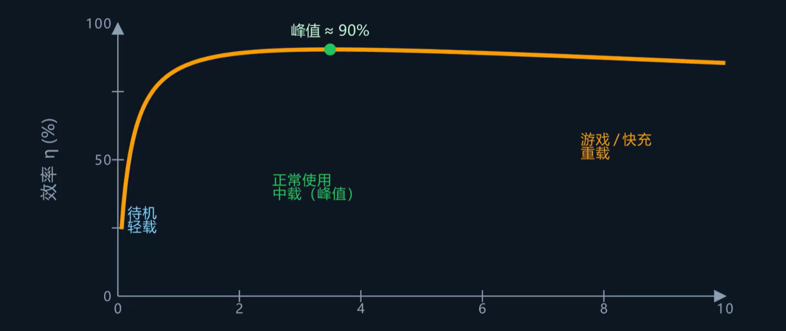

## 效率的定义

$$\text{效率} = \frac{\text{输出功率}}{\text{输入功率}}$$

输入减去输出就是**损耗**。损耗几乎全部转化为热，因此效率越高，发热越少。

## 两大损耗来源

### 导通损耗

电流流过电阻时产生的发热，即**导通损耗**。其大小正比于电流的平方：

$$P_{\text{导通}} \propto I^2$$

大电流场景下导通损耗会急剧增加，这是电源设计中需要重点关注的部分。

### 开关损耗

开关电源中的开关管每次切换的一瞬间，MOS的电压和电流同时存在，产生一部分功率损耗。这个损耗正比于**开关频率**，与负载电流大小关系不大，是一笔固定的开销：

$$P_{\text{开关}} \propto f_{\text{sw}}$$

### 开关电源的效率曲线

导通损耗随电流增大而增大，开关损耗基本固定。两者叠加后，效率曲线呈现**拱形**：

| 负载区间 | 效率表现 | 原因                         |
| -------- | -------- | ---------------------------- |
| 轻载     | 低       | 输出功率小，固定开销占比大   |
| 中载     | 最高     | 导通损耗适中，固定开销被摊薄 |
| 重载     | 下降     | 导通损耗（I²项）急剧增大     |

手机在大部分时间处于待机或轻载状态，因此厂商会极力优化待机功耗。常见手段包括让芯片在空闲时采用**跳周期**（burst mode）等策略，减少不必要的开关动作，从而压低固定开销。

拓展知识：开关电源的 DCM 与 CCM ，其中 DCM 牺牲纹波和响应时间，换取更高的转换效率。

## 线性稳压器与开关稳压器

### 线性稳压器（LDO）

线性稳压器的工作原理类似于串联在电路中的**可调电阻**，通过卡掉多余的压差来实现稳压。损耗为压差乘以电流：

$$P_{\text{LDO}} = (V_{\text{in}} - V_{\text{out}}) \times I$$

效率近似等于输出电压除以输入电压：

$$\eta_{\text{LDO}} \approx \frac{V_{\text{out}}}{V_{\text{in}}}$$

例如 5 V 降到 1 V，效率最高只有 20%，其余 80% 全部变成热量。

### 对比

| 特性       | 线性稳压器               | 开关稳压器               |
| ---------- | ------------------------ | ------------------------ |
| 效率       | 低（压差大时尤其差）     | 高（通常 90% 以上）      |
| 输出噪声   | 低，输出干净             | 有纹波噪声               |
| 体积与成本 | 小且便宜                 | 相对较大、成本较高       |
| 适用场景   | 小电流、对噪声敏感的供电 | 大电流、需要高效率的供电 |

## 快充的发热优化

上百瓦的快充充电器功率很大，但发热反而不算严重，主要靠两个措施：

### 高压低流

提高传输电压、降低电流。线缆上的损耗正比于电流的平方，电流降一半，线缆损耗降到四分之一。这也是为什么快充协议普遍采用高电压方案。

### 电荷泵

电荷泵用电容而非电感来搬运电荷。在输入电压恰好是输出电压整数倍时，效率可以达到 97% 以上。目前手机快充中广泛使用电荷泵进行高压到低压的转换。

## 测量电源效率

### 测试方法

使用**电子负载**从轻载逐步扫到满载，在每个负载点分别测量输入功率和输出功率，计算效率，然后将所有点连成一条**效率曲线**。

### 注意事项

1. **测点要贴在器件引脚上**：不要在远离器件的导线上测量，否则导线电阻引入的压降会导致测量结果不准确。
2. **电流要测准**：电流测量的误差会直接传导到效率计算中，务必使用精度足够的电流探头或采样电阻。

### 热像仪辅助

用**热像仪**对电路板进行拍摄，可以直观地看出哪些元件温度最高，从而定位损耗最大的地方。
