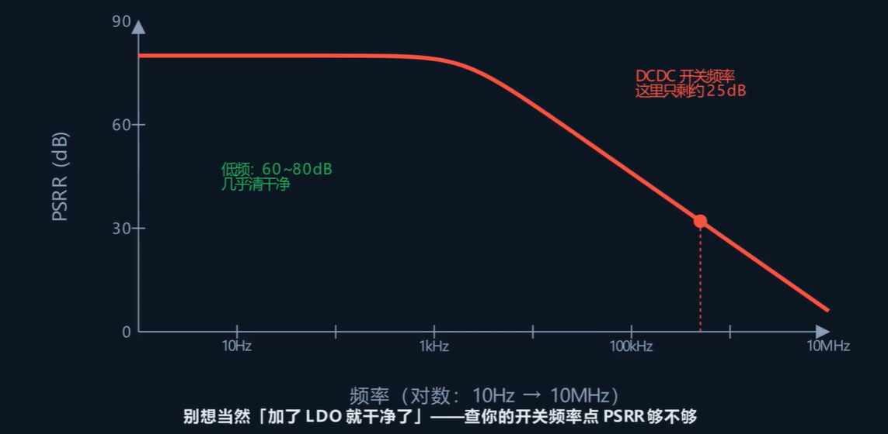

## LDO 在电路中的位置

LDO 一般接在 DC-DC 后面，用于**后级滤波**。DC-DC 效率高但输出有纹波，LDO 效率低但输出干净，两者配合，先用 DC-DC 降压保证效率，再用 LDO 把纹波滤掉保证供电质量。

## 主要参数

### 1. 电源抑制比（PSRR）

PSRR（Power Supply Rejection Ratio）是衡量电路抑制电源电压变化对输出信号影响能力的指标。

数值越大，抑制能力越强，每 20 dB 代表压低 10 倍。在低频段，好的 LDO 能做到 60～80 dB，输入端的纹波几乎被完全隔离。频率升高后，PSRR 会逐渐变差，到了 DC-DC 的开关频率附近，可能只有 20～30 dB，纹波容易越过 LDO 进入后级。

在实际情况中，不能认为 LDO 的供电就一定是干净的，必须考虑 PSRR 在前级DCDC开关频率下的性能表现。

### 2. 输出噪声

即使输入端完全干净，**LDO 自身也会产生噪声**。噪声来源是 LDO 内部的基准电压源和误差放大器，它们天生带有一定的底噪。

普通 LDO 的输出噪声大约几十微伏（μVrms），超低噪声型号可以压到 1 μVrms 以下，价格也更贵。对射频模块来说，供电噪声会直接变成**相位噪声**，影响接收灵敏度；对音频模块来说，供电噪声会变成可听到的**底噪和滋滋声**；对模数转换基准来说，供电噪声会影响转换精度。

### 3. 压差（Dropout Voltage）

压差是指 LDO 正常稳压时，**输入电压至少要比输出电压高出多少**。

压差越小越好：一来效率更高，浪费的压差更少；二来电池快没电时，输入电压已经很低，压差小的 LDO 还能继续稳住输出。一旦输入电压掉到压差临界点以下，LDO 就会**退出稳压状态**，退化成一个电阻，输出电压跟着输入电压一起下降。

## 参数测量方法

### PSRR 测试

使用信号源在 LDO 输入端**注入已知幅度的纹波信号**，然后在输出端测量残余纹波。从低频到高频逐步扫描，即可画出一条 PSRR 随频率变化的曲线。重点关注 DC-DC 开关频率点上的 PSRR 值是否足够。

### 输出噪声测试

使用**低噪声前置放大器 + 频谱仪**，在输出端测量 LDO 的本底噪声。测量带宽一般做到 100 kHz，对噪声进行积分得到总噪声值。测试环境必须足够干净，否则测量仪器自身的噪声会淹没 LDO 的噪声。

### 压差测试

固定负载电流，从高到低调节LDO 的输入电压，同时监测输出电压。当输出电压开始偏离目标输出电压，输入与输出电压之差就是该负载条件下的压差。

## 全部测试指标

以上三项只是 LDO 最核心的指标，完整的测试远不止这些。LDO 的测试可以分为以下六类：

| 指标     | 测试内容                                |
| -------- | --------------------------------------- |
| 直流精度 | 输出电压精度、负载调整率、线性调整率    |
| 噪声     | 输出噪声（μV 级）、PSRR                 |
| 抗扰     | 电源纹波抑制、瞬态响应                  |
| 稳定性   | 环路稳定性、不同负载/电容条件下的稳定性 |
| 动态特性 | 负载瞬态响应、静态电流（Iq）            |
| 保护功能 | 过流保护（OCP）、过温保护（OTP）        |
