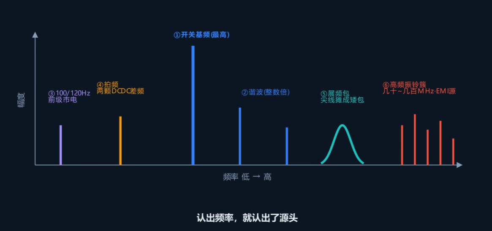

电源的输出纹波超标，一味增加电容不一定能解决问题。可以利用示波器的 FFT 功能在频域上分析纹波的来源，对症下药降低电源纹波。

## FFT 是什么

FFT（快速傅里叶变换，Fast Fourier Transform）是一种数学工具，能把一段时域信号分解成各个频率分量的叠加。

## 电源纹波的来源

从频谱上可以把电源的纹波分成六类：

### 开关基频

通常是频谱上最高的那根线。目前主流DCDC开关电源芯片的开关频率在几百k-1M左右。

### 谐波

频率为开关基频的整数倍，且逐渐变小。开关边缘越陡，谐波就越丰富。

### 低频

来自于前级交流市电，通常为50/100/120Hz。市电 50 Hz 全波整流后变成 100 Hz（60 Hz 市电则为 120 Hz），如果前级 AC-DC 的滤波不够干净，这个频率就会出现在后级 DC-DC 的输出纹波里。

### 拍频

当板上存在两个及以上频率接近的开关电源，就会产生一个频率等于二者之差的拍频。

### 展频（Spread Spectrum）

有些 DC-DC 会故意让开关频率在小范围内来回抖动，将原本集中的基频谱线展宽，变成频谱上一个幅值较低的凸起。展频的目的是降低 EMI 峰值以便通过 EMC 认证。

### 高频振铃

通常为几十-几百MHz，是主要的EMI来源。

## 示波器 FFT 设置

### 频率分辨率 RBW

频率分辨率是频谱显示的最小刻度单位。抓取的波形时间越长（增加示波器的”时基（Time/Div）”），频率分辨率就越细，越能把频域上挨得近的两根谱线分开。如果频率分辨率不够，两根谱线就会混成一根。

### 混叠（Aliasing）

如果采样频率不够，高频就会混叠到低频，影响判断。按照奈奎斯特定理，采样率需要大于所关注频率的两倍。实际情况下建议为5-10倍。

### 窗函数

窗函数选错导致频谱泄露，不仅尖峰不明显，幅度测量也不准确。平常使用 **Hanning 窗** ；需要准确测量某根线的幅度，换成 **Flat Top 窗**。如果信号很微弱或者频率很高，示波器 FFT 看不清，就上频谱分析仪。

## 改进措施

对于前面提到的六类纹波，可以从下面六个改进措施入手：

### 开关低频/低次谐波

- 加大输出滤波电容
- 加 LC 后级滤波
- 后级加 LDO

### 高频谐波/振铃

- 收紧功率回路面积
- 加 RC 缓冲电路（Snubber）
- 放慢开关边沿
- 去耦屏蔽

### 拍频

- 把两颗芯片的时钟同步
- 把两者的开关频率间隔拉开足够大

### 交流市电纹波

优化前级 AC-DC 的整流滤波，加大 bulk 储能电容。
