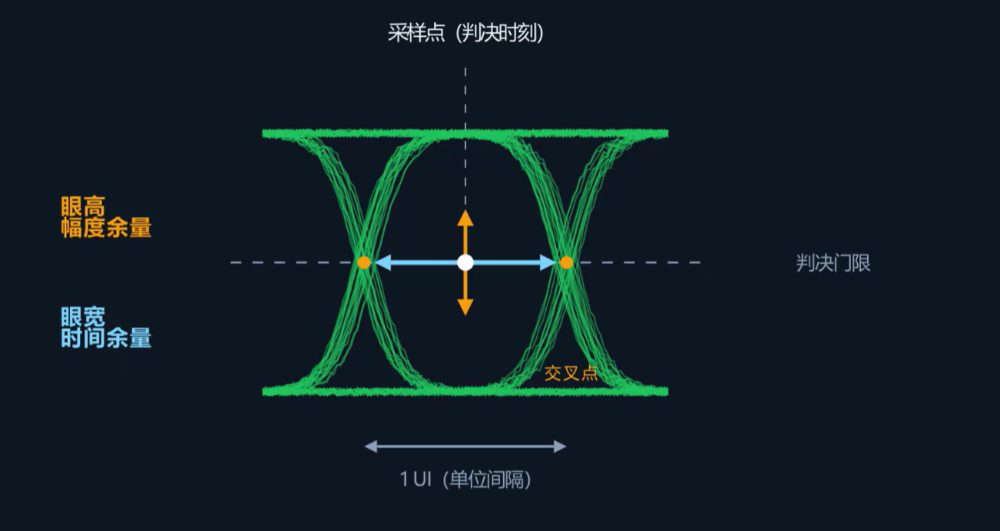

前面的模块讲的是电源完整性（PI），关注的是供电轨的稳定性——纹波、掉压、PDN阻抗。从这一篇开始进入信号完整性（SI），关注的是信号传输的波形质量：发送端发出一个方波，接收端收到的波形是否仍能被正确判决为方波。

同一根铜线，低速下信号质量正常，切换到高速后便出现信号完整性问题。决定因素不是时钟频率，而是信号的**上升时间**（边沿的陡峭程度）。当上升时间较长时，信号的变化在整根线上几乎同时建立，铜线可视为等电位的理想导线；当上升时间足够短时，信号边沿的变化无法在整根线上同步建立，而是以电磁波的形式从发送端向接收端传播，此时铜线必须作为**传输线**处理，表现出特征阻抗（常见值为单端50Ω，差分100Ω）。经验判据：当信号在走线上的单程传播时延超过其上升时间的约1/6时，该走线应按传输线处理。

## 传输线的主要问题

### 反射

信号在传输线上以电磁波的形式传播。只要沿途特征阻抗保持一致，信号就能无反射地传输到终端。但一旦遇到**阻抗突变**的位置——接头、过孔、直角拐弯、线宽变化、末端未端接——就有一部分能量被反射回来。

**反射系数公式：**

$$\Gamma = \frac{Z_L - Z_0}{Z_L + Z_0}$$

其中 $Z_L$ 是负载阻抗，$Z_0$ 是传输线特征阻抗。三种极端情况如下：

| 末端情况 | 反射系数 | 效果                                                   |
| -------- | -------- | ------------------------------------------------------ |
| 开路     | +1       | 信号全反射，同向叠加，电压可达入射波幅值的两倍（过冲） |
| 短路     | -1       | 信号全反射，反向叠加，电压抵消为零                     |
| 阻抗匹配 | 0        | 无反射，信号全部传输至负载                             |

反射波与入射波叠加，在走线上多次往返传播，导致波形出现**过冲、下冲以及逐渐衰减的振铃**。这些畸变一旦超过接收端的判决门限，就会导致误判（0判为1或1判为0）。

因此需要做**端接匹配**——使终端阻抗等于传输线特征阻抗，将反射系数降至零，消除反射。

### 串扰

相邻走线之间通过电磁场产生耦合：

- 一条走线上变化的电场通过**互容**耦合到相邻走线
- 变化的磁场通过**互感**耦合到相邻走线

当一条走线（攻击线）电平发生跳变时，会在相邻走线（受害线）上感应出噪声尖峰，即使受害线上的信号自身并未发生跳变。

串扰分两个方向：

- **近端串扰（NEXT）：** 耦合至信号源方向
- **远端串扰（FEXT）：** 耦合至接收端方向

密集排布的高速并行总线（如DDR的地址/数据线）最易受串扰影响——多条走线同时跳变，耦合噪声叠加后可能导致接收端误判。

**抑制思路：** 拉开线间距、在信号之间插地线隔离、缩短并行走线长度。

**串扰的严重程度取决于：** 走线间距越小、并行长度越长、信号边沿越陡，耦合越强。

### 损耗

信号沿走线传播时，能量会逐渐衰减。损耗主要来自两方面：

**一是导体损耗（趋肤效应）。**
频率升高时，电流趋向于集中在导体表面的薄层内传导，而非均匀分布在整个截面。等效交流电阻与频率的平方根成正比——频率越高、走线越细，导体损耗越大。

**二是介质损耗。**
PCB板材（如FR4）的绝缘介质在高频交变电场中会产生能量耗散。频率越高、走线越长，介质损耗越大。

导体损耗与介质损耗叠加后，等效于一个**低通滤波器**：高频分量的衰减远大于低频分量。而方波的陡峭边沿恰恰依赖于大量高频分量的叠加——高频分量被衰减后，边沿变缓，幅度减小。此外，一个比特的能量还会拖尾到后续比特上，造成**码间干扰（ISI）**。

同一条链路，速率越高、走线越长、板材介质性能越差，损耗越显著。

## 眼图

反射、串扰、损耗的机制各不相同，但最终都会体现在眼图上。

**眼图的生成方式：** 将接收端信号按一个比特周期分段截取，全部叠加在一起。大量0→1和1→0的跳变轨迹叠加后，中央形成一个类似眼睛的张开区域。

- **眼高（幅度余量）：** 扣除噪声、串扰、损耗造成的衰减后，接收端可用于区分0和1的有效电压幅度
- **眼宽（时间余量）：** 扣除抖动和码间干扰造成的压缩后，可用于稳定采样的有效时间窗口

信号质量越好，眼图张开幅度越大。反射、串扰和损耗共同作用时，眼高与眼宽被逐步压缩，直至完全闭合。眼图闭合意味着在采样时刻不存在足够的电压余量和时间余量来可靠区分0和1，此时误码率将显著上升。

眼图本身无法定位具体的问题来源，但它能综合评估链路是否满足设计规范要求。

## SI测试方法

| 方法     | 工具                  | 测什么                                                                                                      |
| -------- | --------------------- | ----------------------------------------------------------------------------------------------------------- |
| 看波形   | 示波器                | 测量过冲、振铃、边沿速率；生成眼图评估整体余量；进行抖动分解                                                |
| 反射定位 | TDR（时域反射计）     | 向走线注入一个阶跃脉冲，根据反射波形反推沿线阻抗变化，定位阻抗不连续点（过孔、接头等）                      |
| 看传输   | VNA（矢量网络分析仪） | 测量S参数：S21表征插入损耗（信号从输入端到输出端的传输衰减），S11表征回波损耗（输入端因反射造成的能量损失） |
