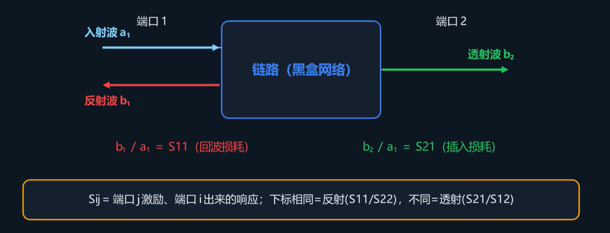
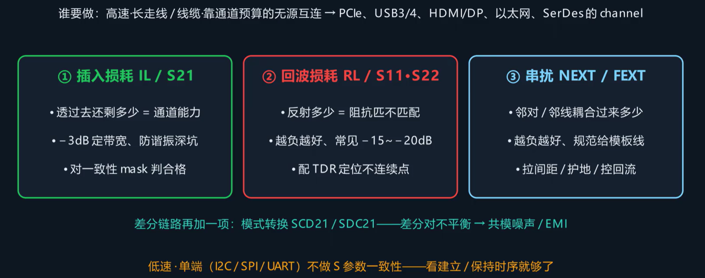

## S参数的概念

**S 参数**（Scattering Parameters，散射参数）用于描述线性网络在频域下的端口特性。通过矢量网络分析仪（VNA）测量传输线的 S 参数，可以量化信号的反射和传输行为。

将传输线简化为一个双端口黑盒，设端口 1 的入射波为 a₁、反射波为 b₁，端口 2 的入射波为 a₂、反射波为 b₂。当仅从端口 1 馈入信号且端口 2 接匹配负载（即 a₂ = 0）时：

- S11 = b₁ / a₁ —— 回波损耗
- S21 = b₂ / a₁ —— 插入损耗

测量高速链路质量，通常需要测试三项：插入损耗（S21）、回波损耗（S11）和串扰。

## S参数的分类

对于双端口网络，S 参数包含四种：

| 数学符号       | 中文名称     | 计算公式                         | 功能描述                                                                                      |
| -------------- | ------------ | -------------------------------- | --------------------------------------------------------------------------------------------- |
| S11 | 输入反射系数 | S11 = b₁ / a₁ \| a₂=0 | 端口 1 的反射波与入射波之比（输入回波损耗）。反映输入端的阻抗匹配程度，值越小（越负）匹配越好 |
| S12 | 反向传输系数 | S12 = b₁ / a₂ \| a₁=0 | 端口 2 到端口 1 的反向传输系数（反向隔离度）。值越小说明反向隔离越好                          |
| S21 | 正向传输系数 | S21 = b₂ / a₁ \| a₂=0 | 端口 1 到端口 2 的正向传输系数（插入损耗）。越接近 0 dB 说明传输损耗越小                      |
| S22 | 输出反射系数 | S22 = b₂ / a₂ \| a₁=0 | 端口 2 的反射波与入射波之比（输出回波损耗）。反映输出端的阻抗匹配程度，值越小（越负）匹配越好 |

S11、S22 反映了反射的大小，反射越小说明阻抗匹配越好；S12、S21 反映了透射的大小，透射越接近 0 dB 说明损耗越小。

对于大多数无源传输线，满足 S12 = S21，这一性质称为**互易**（Reciprocity）。

对于串扰，可以将传输系统的 S 参数理解为从干扰端（Aggressor）输入、从被干扰端（Victim）输出的 S 参数。同一端耦合到的信号是**近端串扰**（NEXT），另一端耦合到的信号是**远端串扰**（FEXT）。

## 从 S 参数改进电路

绘制 S11 曲线后，如果在某个频率点出现尖峰，大概率是过孔、分支等不连续结构引起的谐振。此时可使用时域反射技术（TDR）来定位传输线上引起反射的具体位置。

绘制 S21 曲线后，通常将其下降至 -3 dB 处的频率定义为传输链路的**带宽**。-3 dB 对应功率降至一半，是工程中通用的截止频率标准。
