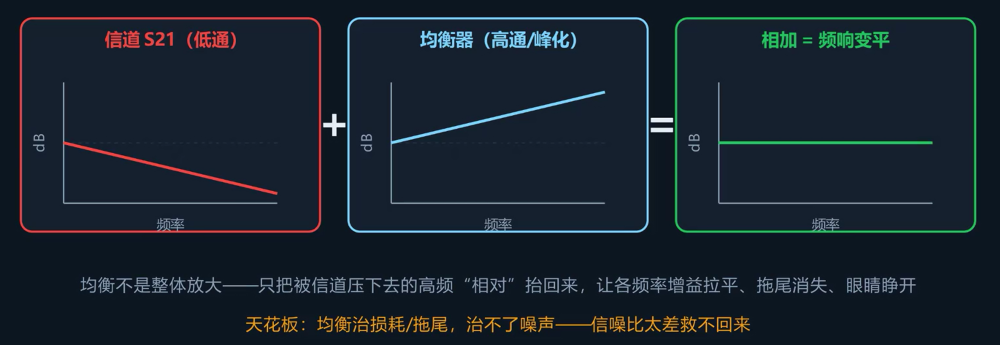
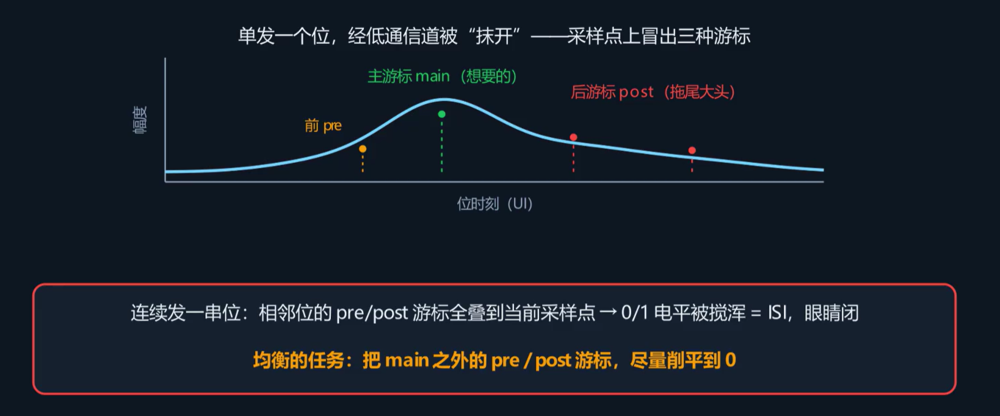
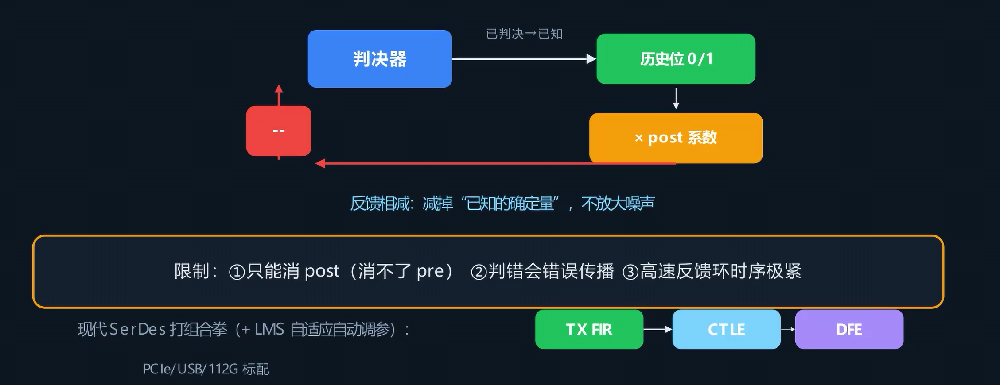

## 均衡的由来

上一篇 S 参数给出了定量结论：高速走线本质是一个低通滤波器——频率越高，插入损耗越大。高速信号的能量集中在高频段，信道对高频衰减严重，反映到眼图上便是眼图开口几乎闭合：边沿变钝、拖尾延伸，一个比特的能量扩散至后续多个比特的时间位置上，采样点无法区分 0 还是 1，误码率急剧升高。

传统思路只有两种方案：换用损耗更低的高速板材（成本高），或者缩短走线（布局空间不足）。工程上提供了第三种方案：均衡。

## 均衡的原理

### 抵消信道衰减

信道的 S21 曲线是一条随频率递增而衰减的曲线——低频几乎不衰减，频率越高衰减越大。均衡的思路是：做一个频响与信道相反的整形器——信道在高频衰减多少 dB，均衡器就让高频增益提升多少 dB。两条曲线叠加，整条链路的频响曲线就能恢复平坦。

**均衡不是放大，而是整形：压低低频的增益，抬高高频的增益，使各频率的增益趋于一致。** 如果所有频率分量等比例放大，信道的频率选择性衰减仍在，眼图仍然闭合。

### 适用范围

均衡只能重整已有信号的形状，不能产生新的信息。因信道损耗而衰减的高频分量可以通过均衡恢复；但如果眼图闭合的原因是噪声幅度已接近信号电平、判决边界模糊，使用均衡技术则无法改善。

**均衡补偿的是信道损耗引起的拖尾和码间干扰，无法补偿噪声。**

## 码间干扰（ISI）

理解均衡的核心是**码间干扰**（ISI，Inter-Symbol Interference）。

考虑单独发送一个比特——一个窄脉冲进入链路，在接收端观察其到达波形。理想情况是：该脉冲仅在自己这个比特的采样时刻有值，其他时刻均为零。但经过低通信道后，脉冲在时域上被展宽，能量延伸至前后多个比特的时间范围内。

在脉冲波形上每隔一个 UI 取采样值，得到若干**游标**（cursors）：

- **主游标（Main Cursor）**：落在当前比特采样时刻的值，是所期望的信号分量。
- **后游标（Post-Cursor）**：拖尾延伸到后面几个比特上的分量，是码间干扰的主要来源。
- **前游标（Pre-Cursor）**：在时序上早于主比特即泄漏到前一个比特上的分量，通常较小。

单个比特的拖尾本身不构成问题，但真实信号是一长串比特连续发送——当在某一个比特做判决时，接收端看到的不只是该比特自身的主游标，还叠加了前面比特残留的后游标和后面比特泄漏的前游标。**其他比特的拖尾分量在当前比特的采样时刻相叠加，使判决电平的 0 和 1 发生混叠——这就是码间干扰，也是眼图闭合的直接原因。**

均衡的任务就是将主游标之外的前后游标消除至零。

## 均衡的方法

### 发送端预加重/去加重

位置在发送端。预加重和去加重是两种等价的做法，目标相同——使比特跳变对应的高频分量相对于连续不变的低频分量获得更大的增益：

- **预加重（Pre-emphasis）**：将跳变后的第一个比特幅度加大，增强跳变沿的幅度。
- **去加重（De-emphasis）**：将连续未跳变的比特幅度压低，降低低频分量的幅度。

两种做法在接收端的效果完全相同：跳变沿（高频分量）相对于不变段（低频分量）更突出。通常用一个分贝值量化（如 3.5 dB、6 dB）。

这种方法的具体实现是使用一个抽头数很少的 FIR 滤波器。在信号尚未混入接收端噪声之前完成整形，因此不会放大接收端噪声。代价是发送端总摆幅有上限，跳变沿幅度的提升通常以降低非跳变比特的幅度为代价，整体信号能量并未增大。

### 接收端 CTLE（连续时间线性均衡器）

CTLE 全称 Continuous-Time Linear Equalizer。CTLE 通常位于接收端，它的本质是一个模拟滤波器，增益曲线在高频区上翘，补偿信道随频率递增而衰减的 S21 曲线。信号进入后即实时被整形，不需要时钟，不需要判决。

这种方法的优点是结构简单、功耗低，前游标和后游标均能补偿。但是也存在局限：CTLE 是线性放大器，抬高高频增益时，落在高频段的噪声和串扰也被一并放大。因此 CTLE 的增益不能设置过高——增益不足则高频补偿不充分，眼图仍然闭合；增益过高则高频信号被补偿的同时噪声也被放大，信噪比反而恶化。这一现象称为**过均衡**。

大多数高速链路的接收端都会先配置一级 CTLE 作为前置均衡。

### 接收端 DFE（判决反馈均衡器）

全称 Decision Feedback Equalizer，通常位于接收端，CTLE 之后。DFE 的思路与 CTLE 完全不同，因为 DFE 是**非线性的**。

当前比特受到的后游标拖尾是前面几个比特残留的，而前面那几个比特已经判决完毕，明确已知是 0 还是 1。**将已知的历史比特各自乘以对应的后游标系数，反相后从当前信号中减去，即可精确抵消后游标的拖尾分量**。

DFE的优势是，它在信号中减去已知的确定量，而不是仅仅放大信号，因此不会放大噪声，恰好弥补了 CTLE 的主要局限。DFE 的局限性如下

1. **只能消除后游标，不能消除前游标**。DFE 依赖已判决的历史比特进行反馈，前游标来自尚未到达的未来比特，无法用于反馈抵消。
2. **依赖判决正确**。若某个比特判决错误，该错误会被反馈回环路，导致后续比特的判决也出错，沿时间轴逐比特向后传播——称为**错误传播**。
3. **时序约束极紧**。判决 → 反馈 → 相减 → 再判决的整个环路必须在一个比特时间（一个 UI）内完成闭环，这限制了 DFE 的抽头数量和可用于的速率上限。

### 组合方案

现代高速接口不单独使用某一种方法，而是三种方法级联：

> 发送端 FIR（预加重/去加重） → 接收端 CTLE（前置均衡） → 接收端 DFE（消除后游标）

三者各自承担不同功能。PCIe、USB、以太网等高速收发器均采用此架构。

这些参数不是手动固定设置的，而是自适应的。芯片使用 LMS（最小均方）等自适应算法，在接收数据的同时自动调整均衡参数，朝眼图开口最大、误码最小的方向迭代收敛。链路训练（Link Training）阶段的观测现象即为这一自动寻优过程。

## 均衡测试

### 适用范围

均衡是为高速收发器设计的补偿手段。需要纳入均衡测试的场景：速率约 5–8 Gbps 以上、走线较长、依靠通道预算维持眼图开口的链路——PCIe、USB、DDR、高速以太网、DisplayPort 等。高频损耗会导致眼图闭合，必须纳入均衡测试。

低速单端总线如 I²C、SPI、UART，频率低、走线短，损耗可忽略，不使用均衡，检查建立/保持时序即可。

### 测试项目

1. 发送端均衡测试：逐档测量预加重/去加重的档位波形，检查每个档位的输出波形和参数是否符合对应接口规范中的模板。

2. 接收端压力眼测试：用仪器向信号中注入可控的码间干扰、抖动和噪声，馈给被测接收端，在目标误码率下考察接收端的均衡能力能否将劣化后的信号恢复到误码率达标水平。

3. 均衡前后对比：比对链路上均衡前后的眼图——从闭合到重新睁开，同时确认链路训练过程能正常收敛。

以上测试的档位表、压力眼参数、眼高眼宽模板均定义在对应接口的一致性规范中（PCIe、USB、DDR、以太网各有自己的标准组织和规范文档），按规范执行即可。

### 余量评估

不能仅以"通过/不通过"的二元判断下结论。应检查余量：眼高眼宽还剩余多少、误码率离门限还差几个数量级。接近限值勉强通过的链路，量产中的批次波动或温度漂移仍会导致边缘失效。

## 调试流程

施加均衡后眼图仍然闭合、误码率仍然偏高、模板测试不通过——应按以下流程排查，而非无方向地尝试参数调整：

### 确认均衡已启用

很多"均衡无效"的判断，实际是均衡未被正确启用。逐项检查：

- 发送端预加重/去加重的档位配对是否正确？
- 接收端 CTLE 和 DFE 是否已打开？
- 链路训练是否已收敛？

### 按现象分类处理

观察眼高、眼宽和误码率的具体表现，分别处理：

- **欠均衡**：高频补偿不足，眼图垂直方向开口不足 → 加大 CTLE 增益（peaking）或发送端去加重。
- **过均衡**：高频补偿过度，噪声也被放大，眼图反而进一步劣化 → 降低 CTLE 增益和发送端去加重。
- **DFE 错误传播**：特征为误码成串出现、不呈随机分布 → 降低对 DFE 的依赖，先用发送端 FIR 和 CTLE 改善信号的基础质量，减少 DFE 需要抵消的后游标量。
- **发送端信号质量不合格**：输出摆幅不足或边沿过差 → 返回发送端排查问题，不应试图仅靠接收端均衡强行补偿。

### 检查余量

不应仅关注模板是否通过，确认眼高眼宽的裕量充足。

### 复测确认

针对具体问题调整参数后必须复测，确认均衡后眼图回到模板以内且余量充足。

### 基本原则

**信噪比不足时，眼图闭合的原因是噪声幅度过大，而非损耗未补偿。** 均衡无法补偿噪声。若已确认均衡启用且不过量，眼图仍然闭合——应排查噪声、串扰和参考电平，而非继续增加均衡增益。均衡增益设置再高，也无法将被噪声淹没的信号分离出来。
