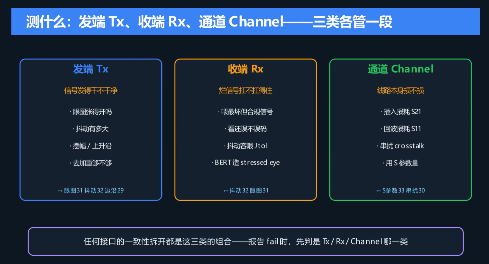
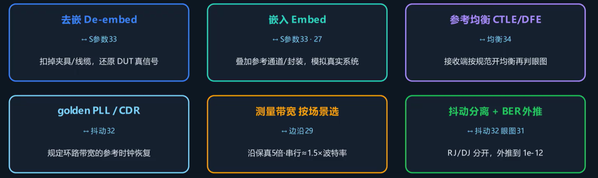

之前讲解了 SI 与 PI，现在开始将会把这些知识应用到实际的高速接口测试中来。

USB、HDMI、DP、PCIe的背后都有制定其规范的协议组织，这些组织会对使用它们协议的产品制定严格的规范：如何测试、有哪些测试指标等。只有满足这些测试指标的产品才能通过对应的认证，然后在市场上销售。

发送端主要看发出的信号质量好不好，接收端则看收到的信号能不能正确判别。测试时，使发送端信号产生不同频率、大小的信号抖动，然后在接收端测试其误码率要求下的最大抖动，绘制`抖动频率-抖动幅度`**抖动容限曲线图**。产品的实测抖动容限图应当位于标准抖动容限曲线的外侧，以证明在任何抖动频率和幅度下产品的抖动容限都不小于协议标准。

测试时除了信号发射器、高速示波器和误码仪等仪器，通常还需要使用特定的测试软件进行分析。测试时的注意事项参考下图。

