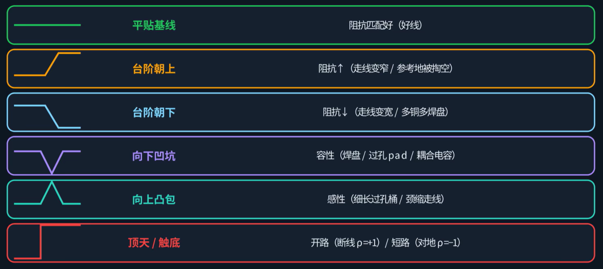
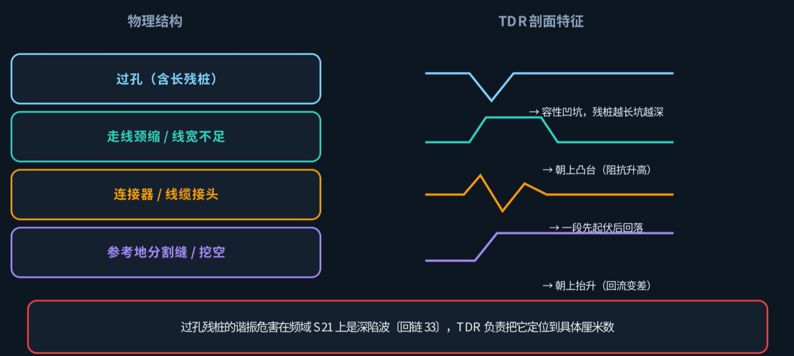

## TDR 的作用

上一篇介绍了高速接口一致性测试的整体框架，本篇开始进入具体测试项的讲解。第一个是 TDR，几乎每个高速接口的通道诊断都会用到它。

在一致性测试中，如果通道的 S11 回波损耗曲线在某个频率上出现峰值，回损明显恶化，眼图也可见闭合，说明通道上存在阻抗不连续点。但一条走线从连接器、走线、过孔到芯片焊盘往往十几厘米长，回波损耗和眼图只能表明存在阻抗不连续点，但无法给出不连续点的具体物理位置。TDR 就是用来解决这个问题的。

## TDR 的工作原理

TDR 向传输线输入一个上升时间极短的电压阶跃，台阶沿走线向前传播，遇到阻抗突变处就会反射一部分回输入端。TDR 在输入端接收这些反射信号，通过反射的**幅度** 和**时延**，计算阻抗不连续点的阻抗大小和位置，从而绘制传输线上阻抗随距离变化的曲线。

1. **反射幅度** → **阻抗偏离量**：反射系数 Γ = (Z − Z₀) / (Z + Z₀)。Z₀ 为参考阻抗（单端 50 Ω，差分 100 Ω）。Γ 为正说明该点阻抗高于参考值，Γ 为负说明低于参考值，|Γ| 越大说明偏离越严重。
2. **反射时间** → **不连续点的位置**：距离 = 信号速度 × 时间 ÷ 2。÷ 2 是因为信号需要先传播到不连续点再反射回来，走了一个来回。在常见 FR4 板材上，信号速度约 15 cm/ns，即每厘米约需 67 ps。反射延迟 1 ns，不连续点就在约 7.5 cm 处。

TDR 的核心原理是将反射时延换算为物理距离。

## TDR 曲线

TDR 曲线是一条阻抗随距离（横轴）变化的曲线，规则如下：

- 曲线落在基线上——阻抗匹配，没有反射。
- 曲线高于基线——该段阻抗偏高（感性）。
- 曲线低于基线——该段阻抗偏低（容性）。
- 上升一个台阶且不回落——整段阻抗改变。
- 形成一个凸包再回到基线——局部一小段阻抗偏高。
- 形成一个凹坑再回到基线——局部一小段阻抗偏低。
- 曲线急剧上升至最大值——开路，反射系数为 +1，阻抗趋于无穷。
- 曲线急剧下降至零——短路，反射系数为 −1，阻抗趋于零。

## 典型结构的 TDR 特征

不同物理结构在 TDR 曲线上呈现固定的特征：

| 结构                | TDR 表现             | 物理原因               |
| ------------------- | -------------------- | ---------------------- |
| 过孔、焊盘          | 向下的凹坑           | 通常呈容性，阻抗偏低   |
| 走线变窄            | 向上的凸包           | 感性，阻抗偏高         |
| 过孔残桩（stub）    | 向上的凸包           | 感性，阻抗偏高         |
| 连接器/接插件       | 一高一低连续起伏     | 多个不连续点交替       |
| 参考平面开缝/跨分割 | 向上的凸包           | 回流路径延长，电感增大 |
| 断线                | 曲线急剧上升至最大值 | 开路，全反射           |

根据这些特征，可从横轴读出不连续点的物理位置，并推断对应结构的类型。

## 分辨率与上升时间

TDR 能分辨多近的两个不连续点，取决于电压台阶的上升时间（边沿陡峭程度）：

$$\text{分辨率} \approx \frac{\text{信号速度} \times \text{上升时间}}{2}$$

| 上升时间 | 近似分辨率 | 对应带宽（0.35/tr） |
| -------- | ---------- | ------------------- |
| 20 ps    | ≈ 1.5 mm   | ≈ 17.5 GHz          |
| 35 ps    | ≈ 2.6 mm   | ≈ 10 GHz            |
| 100 ps   | ≈ 7.5 mm   | ≈ 3.5 GHz           |
| 200 ps   | ≈ 1.5 cm   | ≈ 1.75 GHz          |

上升时间与带宽的关系：tr ≈ 0.35 / BW。35 ps 的边沿约对应 10 GHz 带宽。

分辨率不足时，两个间距很近的过孔在曲线上会合并为一个宽化的浅坑，无法分辨。被测板本身没有变化，变化的是测量分辨率。因此测高密度板必须使用上升时间足够短的边沿，慢速边沿无法分辨密集结构。

## TDR 与 S 参数的关系

TDR 和 S 参数（第 33 篇）描述的是同一物理现象在时域和频域的两个视角：

- S11 是频域的回波损耗——反映谐振发生的频率和反射的严重程度。
- TDR 是时域的阻抗曲线——反映这些反射来自哪个物理位置。

**对 S11 做傅里叶反变换，得到的就是 TDR 曲线。** 两套数据配合使用：频域评估反射的总体严重程度，时域定位反射的具体物理位置。

还有一对对应的概念：一致性测试中使用的**去嵌**（de-embedding），在时域中就是加一道**时间门**（time gating）——只保留所关心那一段时间的反射，将夹具、接头等不关心部分的反射排除在外。这和第 35 篇涉及的测试夹具去嵌逻辑是同一原理的时域表述。

## 三种测试场景

### 阻抗测试条

板厂在拼板边角上留一段与关键走线叠层和线宽相同的**测试条**。出货前，用阻抗仪测量并出具阻抗测试报告。**这份报告可用于证明这批板的工艺参数合格，但不代表板上的信号线一定也是合格的。** 真实走线上有过孔、拐弯、跨分割，而测试条上均不存在这些结构。

### 裸板 PCB

在元件未贴的裸板上，保持远端开路，直接在用户关心的链路测试。测试得到的曲线上每一个凹坑和凸包都是走线自身的结构造成的，排除了器件因素的干扰，是 TDR 测试的主要场景。

### 已贴件的整机板 PCBA

已经贴片的 PCBA 也能测试，但有三个限制条件：

1. BGA 焊球压在芯片底下，探针无法接触焊盘。
2. 两端芯片的封装电容和 ESD 保护二极管本身即引入多处阻抗变化，与走线自身的不连续叠加在一起，无法区分。
3. 若远端芯片已开启片上终端电阻，反射信号会被吸收，曲线尾端形态失真。

因此 PCBA 上的 TDR 主要用于找断点、判短路、查接触状态，这类问题通过 TDR 可快速准确定位。**PCBA 测 TDR，以位置信息为准，不以阻抗数值为准。**

## 操作要点

测量方式有三种：专用 TDR 仪器、采样示波器插 TDR 模块、VNA 先测 S 参数再经傅里叶反变换得出 TDR 曲线。

操作要点：

1. **参考阻抗**：单端 50 Ω，差分 100 Ω，在仪器中正确设置。
2. **校准**：必须先用标准件校准，将参考面推到被测走线起点；否则夹具段会混入测量结果。
3. **差分测量**：两根同轴电缆必须相位匹配，对等长度偏差（skew）须小于 1 ps，否则差分阻抗读数出错。
4. **探针**：使用差分微波探针，压在裸板走线的起点焊盘上。远端保持开路。TDR 曲线上的所有距离均从探针尖端位置起算。
5. **边沿选择**：确保台阶上升时间足够覆盖所需分辨率。
