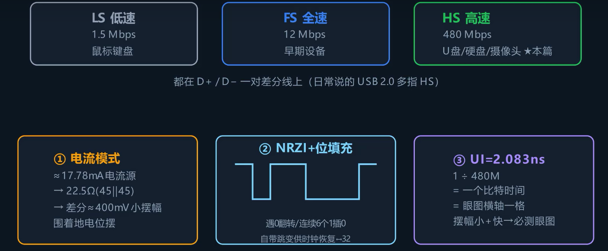
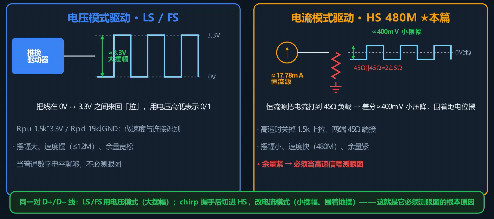
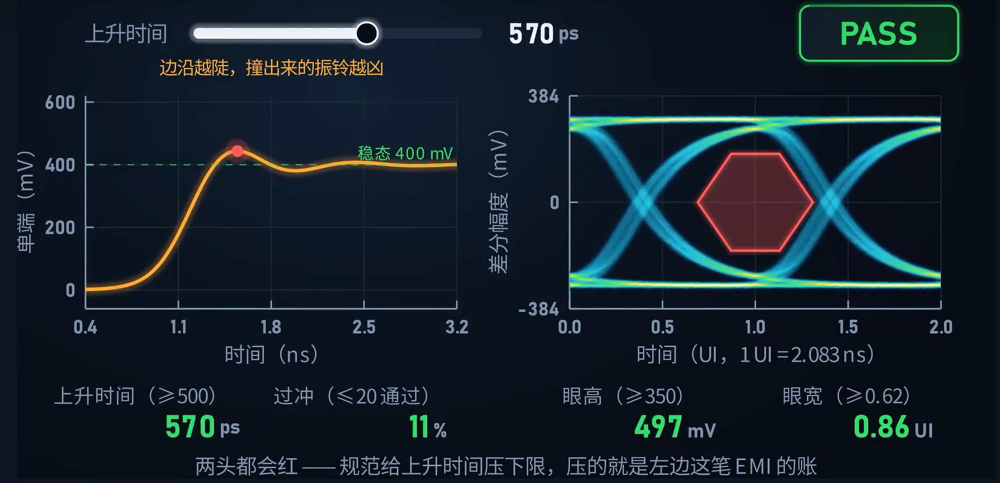
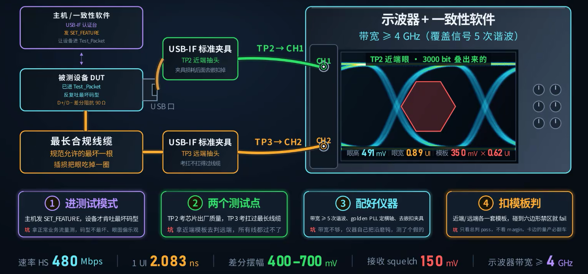

## USB 2.0 的三种速率

USB 2.0 在同一根差分线上支持三档速率：

| 速率名称 | 数据率   | 驱动方式 | 摆幅             |
| -------- | -------- | -------- | ---------------- |
| 低速     | 1.5 Mbps | 电压模式 | 0 V ~ 3.3 V      |
| 全速     | 12 Mbps  | 电压模式 | 0 V ~ 3.3 V      |
| 高速     | 480 Mbps | 电流模式 | ≈ 400 mV（差分） |

日常所说的"USB 2.0"通常指高速模式（480 Mbps）。

## 高速模式的特点

1. **电流模式驱动**：恒流源驱动到差分线两端各自的 45 Ω 终端电阻上，差分摆幅仅约 400 mV，在地电位附近摆动。而低速/全速是电压模式，在 0 V 和 3.3 V 之间拉动，呈现标准数字方波。

2. **NRZI 编码 + 位填充**：NRZI（Non-Return-to-Zero Inverted）编码下，数据为 1 时电平翻转、为 0 时不翻转。为避免长时间无跳变导致接收端时钟漂移，连续 6 个 1 后强制插入一个 0 产生跳变，使接收端能从数据流中恢复时钟。

3. **一个比特仅 2.083 ns**：480 Mbps 下，每个比特宽度即眼图的横轴单位间隔（UI）。

## 眼图模板

低速和全速是电压模式，3.3 V 的摆幅提供了充裕的噪声容限，当作普通逻辑电平检查即可。

高速切换为电流模式后，摆幅从 3.3 V 降至约 400 mV，信号容限大幅减小。线缆质量差异、走线不等长、过孔、跨分割等因素均会使信号进一步劣化——程度较轻时接收端误判要求重传（表现为传输速率下降），程度严重时设备枚举失败。因此需要一个客观、可复现的判决标准来衡量信号质量是否合规，这个标准就是**眼图模板**。

## 信号完整性要点

在测眼图之前，先明确导致信号劣化的主要源头：

1. **PCB 走线**：D+ 和 D− 差分阻抗必须做到 90 Ω，走线等长等宽、紧耦合布线，避免过孔和跨分割平面。

2. **连接器与线缆**：板级走线通常满足设计要求，信号劣化的主要来源是连接器和线缆。

3. **边沿速率不可过快**：规范要求上升时间不低于 500 ps。

## 偏斜与边沿速率的影响

### 偏斜（skew）

D+ 和 D− 的时延差称为偏斜。两条线本应严格互补反向，一旦出现时延偏差：

- **过零点偏移**：差分波形的判决窗口被压缩，眼宽减小。
- **共模尖脉冲**：每个跳变位置在共模电压上产生一个尖脉冲，这是 EMI 的来源。

偏斜的后果可归纳为两方面：**时序上损失眼宽**，**辐射上增加 EMI**。

### 边沿速率（上升时间）

边沿速率对信号质量的影响是非单调的：

- **上升时间过短（边沿过陡）**：过冲和振铃幅度增加，EMI 辐射增强。
- **上升时间过长（边沿过缓）**：眼图受码间干扰（ISI）影响，眼宽和眼高均缩小，信号可能进入模板禁止区域。

规范对上升时间的约束（≥ 500 ps）限定了合规的工作范围——上升时间低于 500 ps 则过冲和振铃超标，上升时间过高则眼图因 ISI 闭合，只有落在规范规定的区间内才能同时满足 EMI 和时序两方面的要求。

## USB 2.0 的一致性测试

与所有高速接口一样，USB 2.0 的一致性测试分为三类：

| 类别   | 测试内容                                                 | 方法                      |
| ------ | -------------------------------------------------------- | ------------------------- |
| 发送端 | 信号质量——让设备发规定码型，示波器捕获后扣模板           | 眼图模板测试              |
| 接收端 | 静噪门限：低于 100 mV 视为噪声忽略，高于 150 mV 必须识别 | 电平灵敏度测试            |
| 通道   | 线缆/连接器的插入损耗和回波损耗                          | 频域用 S 参数，时域用 TDR |

### 按需测试

| 产品角色           | 发送端       | 接收端       | 通道 |
| ------------------ | ------------ | ------------ | ---- |
| U 盘、摄像头等设备 | 测           | 测           | —    |
| 主板上的主机口     | 测           | 测           | —    |
| 集线器上行口       | 测（当设备） | 测（当设备） | —    |
| 集线器下行口       | 测（当主机） | 测（当主机） | —    |
| 仅做线缆/连接器    | —            | —            | 测   |

双向口既发送也接收，因此发送端和接收端均需测试；通道测试仅在产品包含自行设计的线缆或连接器时才需要。

## 发送端眼图：近端与远端

发送端眼图测试设两个测试点，考察不同层面的信号质量：

| 测试点 | 探头位置                 | 考察内容                                   |
| ------ | ------------------------ | ------------------------------------------ |
| 近端   | 发送芯片输出引脚         | 芯片本身的驱动质量                         |
| 远端   | 经过一根最长合规线缆之后 | 信号承受最坏通道损耗后，接收端能否正确识别 |

远端眼图的眼高和眼宽均小于近端，因此近端和远端各用一套模板，远端的模板限值比近端宽。

### 测试模式

通过主机发送命令，使设备进入 **Test Packet 模式**，反复发送最坏码型。近端用标准夹具取信号接入示波器通道 1，远端过完最长线缆后取信号接入通道 2。

### 仪器设置要点

1. **带宽**：示波器带宽需 ≥ 4 GHz，足够覆盖 480 Mbps 信号的五次谐波以上。带宽不足会使仪器测得的信号边沿速率慢于实际值，导致测出的眼图优于实际信号质量，结果不可采信。

2. **时钟恢复**：USB 2.0 没有独立的时钟线，必须从数据中通过软件 CDR 恢复时钟作为眼图的横轴基准。

3. **抖动分解**：抖动需分离为随机抖动（RJ）和确定性抖动（DJ）分别分析（原理见第 32 篇）。

4. **去嵌**：夹具和线缆自身的损耗需用 S 参数从测量结果中扣除（去嵌原理见第 35、36 篇）。

5. **加载模板**：根据测试点是近端还是远端，加载对应的模板进行判定。

### 常见错误

- 用业务流量而非测试码型——业务数据的码间干扰不够严重，无法激发最差情况。
- 用近端模板判定远端信号——远端信号经过线缆衰减后，其眼图无法满足近端模板的限值要求，应使用远端模板。
- 带宽不足——仪器测得的边沿速率偏慢，眼图质量被高估，结果不可采信。
- 只看总判（Pass/Fail）不看余量——余量接近零的项目，量产中因器件差异和温度漂移很可能超出限值。

## 眼图模板的含义

模板的每条线都有明确的物理依据，下文逐项推导。

### 中间六边形

眼图的睁开区域必须完整包含中间的六边形，信号波形不得进入六边形区域。六边形定义的是：

- **垂直方向**：留给接收端的电压余量。
- **水平方向**：留给接收端的时间余量。

### 上下两条外框

限制差分摆幅在 400 ~ 700 mV 范围内。推导过程：

- 接收端静噪门限为 150 mV（低于此值视为噪声，高于此值必须识别）。
- 在此基础上增加 25 mV 裕量，应对温度漂移和器件个体差异。
- 上下两侧各扩展一次，模板总高约 350 mV。

### 水平宽度

- 一个比特 = 2.083 ns。
- 减去抖动占用的 0.38 ns → 剩余 0.62 ns 为模板总宽。

模板上的每一条线，均能从上述三条判据（接收端灵敏度、抖动预算、温漂裕量）中推导得出。

## 线缆长度对眼图的影响

线缆长度对信号的两个维度——幅度和眼宽——的影响规律不同：

- **幅度**：随线缆长度增加基本**匀速下降**。
- **眼宽**：在前 4 米基本维持不变，从第 5 米开始急剧下降。5 米处眼高仅剩约 246 mV，超过 8 米后接收端基本无法正确识别信号。

规范将 USB 2.0 线缆最大长度固定为 5 米，这是根据损耗预算精确计算得出的结果，并非随意指定的值。

## 测试计划

制定一份完整的 USB 2.0 一致性测试计划，分五步：

1. **定版本和速度**：明确待测的是 USB 2.0 的哪一档速率。
2. **定角色、决定测哪几类**：根据产品角色确定发送端/接收端/通道的测试范围。
3. **列全测试项**：逐类展开，不漏项。
4. **每项查标准取判据**：查询对应规范文档，确定每个测试项的具体模板和限值。
5. **排设备、夹具和测试模式，定余量目标**：不只要"通过"，还要明确每项的余量目标。

### 关键文档

查询标准时依赖三份核心文件：

- **电气测试规范**（Electrical Test Specification）：规定模板限值和测试步骤。
- **合规文档**（Compliance Document）：规定认证流程。
- 对于 HDMI、DisplayPort 等其他接口，框架完全相同，仅具体参数不同。

这三份文件的框架对所有高速串行接口通用。

## 解读测试报告

理解测试报告的内容比仅执行测试操作更重要。解读要点：

- **不要只看总判（Pass/Fail）**，关键是每一项的**余量**。
- 余量恰好仅满足限值——虽然判定为通过，但量产中的温度漂移和器件差异可能导致超出限值。
- **按不合格项定位问题根源**：
  - 眼图张开不足、进入模板禁止区域 → 信号质量整体不达标，检查驱动能力和链路损耗。
  - 摆幅超上限 → 驱动过强或存在过冲，检查终端匹配电阻和驱动电流设置。
  - 抖动超出预算 → 回溯检查时钟源、电源噪声、串扰。
  - 仅远端不合格、近端正常 → 问题位于线缆或通道，使用 TDR 定位具体阻抗不连续点。
