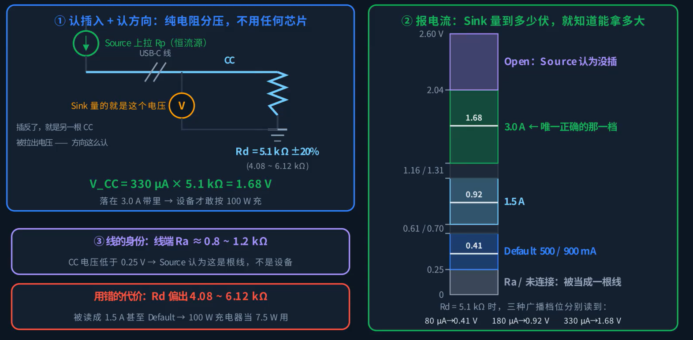
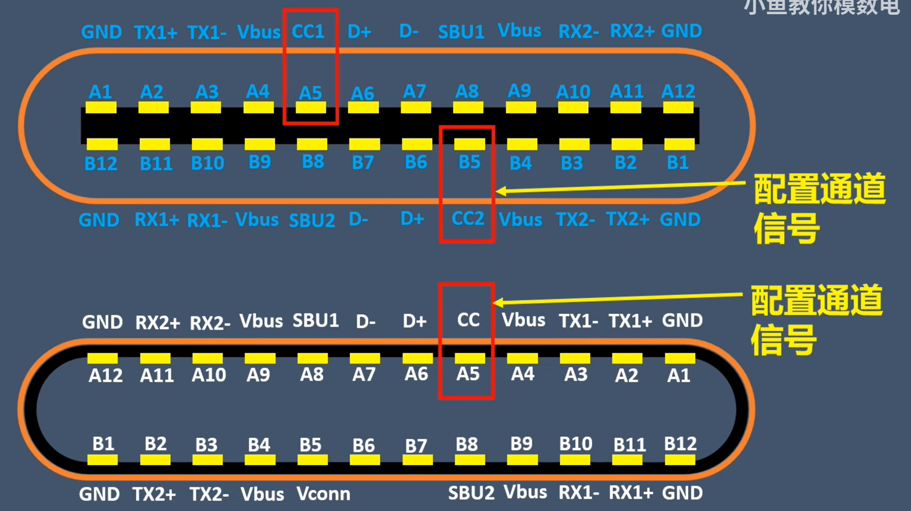

USB-C 接口除了传输数据，还可以供电，最大功率目前能够支持到 240 W。USB PD 的实际供电功率是由充电器和设备通过 CC 引脚协商确定的。

有时候充电器的标称功率很高，但是实际充电功率却少得可怜，这其实就是因为充电协议不匹配导致的。

## 物理接口与传输协议

- **USB-C（Type-C）**：USB-C 是一种 USB 的物理接口形状，包含 24 个针脚，支持正反插。USB-C 接口本身不对传输协议和充电功率做任何保证
- **USB PD**：USB PD 是一种供电协议，双方通过在 CC 引脚上通信，协商出具体的充电电压和电流。

## 供电协议的三个层次

USB-C 的供电分三个层次，当高层次呃供电协议协商失败时，降低至次一级的供电协议进行协商。

| 层次 | 名称            | 协商方式            | 供电规格               |
| ---- | --------------- | ------------------- | ---------------------- |
| 1层  | BC 1.2          | 在D+/D-上握手       | 5 V / 1.5 A            |
| 2层  | Type-C 电流广播 | CC 引脚上的电阻     | 5 V / 3 A              |
| 3层  | USB PD          | CC 引脚上的通信协商 | 5 V ~ 48 V，最高 240 W |

协商不成功时逐级回落到最保守的一层，这就是慢充的根源。

## CC 引脚

USB-C 的正反盲插和供电协商都依靠两根 CC 引脚实现。在协议协商开始之前，仅靠电阻就能完成三件事。

### 1. 方向检测

USB-C 的插座有两根 CC 引脚，而插头上只有一根。电源侧（充电器）在两个 CC 引脚处上拉电阻 Rp，受电侧（设备）在一个 CC 引脚处下拉电阻 Rd（5.1 kΩ）。插上之后有电压的那根 CC 就是实际连通的一面，而另一根 CC 是悬空的，以此实现方向检测。

### 2. 电流能力广播

充电器端使用不同的上拉电阻 Rp，用来在协议协商开始前广播三档电流能力。规范中把 Rp 等效为三个恒流源：

| 档位     | 等效恒流源 | Rd上测得的电压 |
| -------- | ---------- | -------------- |
| 默认档   | 80 µA      | 0.41 V         |
| 1.5 A 档 | 180 µA     | 0.92 V         |
| 3 A 档   | 330 µA     | 1.68 V         |

通过测量电阻 $R_D$ 上的电压，双方就可以协商供电链路上可接受的最大电流。$R_D$ 上的电压可以通过电阻分压或者恒流源来实现。

规范给 3 A 档划定的电压窗为 1.31 ~ 2.04 V，反推得出 Rd 必须落在 3.97 ~ 6.18 kΩ 之间，而 Rd 的标称值 5.1 kΩ ± 20%（即 4.08 ~ 6.12 kΩ）恰好处于该窗口内，因此确定了 5.1 kΩ ± 20% 这一标称值。

Rd 阻值对电流档位识别的影响：

| Rd 状态 | 示例阻值     | CC 引脚电压                     | 对端判定             |
| ------- | ------------ | ------------------------------- | -------------------- |
| 过小    | 0.6 kΩ       | 掉入 1.5 A 档；持续偏小至 0.2 V | 识别为线缆，不予供电 |
| 正常    | 5.1 kΩ ± 20% | 0.41 ~ 1.68 V                   | 档位识别正确         |
| 过大    | 7.6 kΩ       | 2.5 V，超出 3 A 档电压窗上沿    | 判定未连接设备       |

这就是许多大功率充电器功率偏低甚至无法识别设备的原因：并非供电能力不足，而是 CC 引脚上的电阻阻值因精度偏差或焊接不良导致漂移，超出了容差范围，从而引发电流档位误判，最终导致 100 W 的充电器只能提供 5 V / 1.5 A（7.5 W）的输出。

### 3. 给 eMarker 供电

支持大电流或高速的全功能线缆里有一颗芯片，叫 **eMarker**（电子标记芯片），记录这根线能承受的最大电流。当一根 CC 用于通信时，另一根 CC 改作 **VCONN**（约 5 V），用来给线缆中的 eMarker 供电。

## PD 协议通信

电阻只能粗粒度广播到 5 V / 3 A，要上更高电压、上快充，就要需要 USB PD。它需要在同一根 CC 引脚上叠加数字通信。

- 编码方式：**BMC**（双向标记编码），在 CC 上以 300 kbps 的速率收发数据包。
- 编码规则：每一位的边界必然翻转；逻辑 1 在位的中间再翻转一次。波形中包含时钟信息，接收方不需要单独的时钟线。
- 位宽度： 3.33 µs。

## PD 协议版本

充电器把自己能提供的每一档电压电流打包成一个个 **PDO**（供电数据对象）广播出来：

| 类型                         | 档位/范围                                     | 功率       | 备注              |
| ---------------------------- | --------------------------------------------- | ---------- | ----------------- |
| [PD 2.0] 固定档              | 5 V、9 V、15 V、20 V 等                       | 最高 100 W | 基础档位          |
| [PD 3.0] EPR（扩展功率范围） | 在固定档之上增加 28 V、36 V、48 V 档          | 最高 240 W | 部分线缆/设备专用 |
| [PD 3.1]PPS（可编程电源）    | 电压以约 20 mV、电流以约 50 mA 的步进连续可调 | —          | 手机快充大量采用  |

PD 包用 **SOP**（包起始符）区分通信对象。普通 SOP 用于充电器与设备之间的通信；带撇号的 SOP′ 用于与线缆中的 eMarker 通信。

## 协商流程与时序

1. 充电器广播能力表（Source Capabilities），列出支持的电压电流档位。
2. 设备从中选择一档，发送 Request（如请求 20 V）。
3. 充电器回复 Accept，接受请求。
4. 充电器将 VBUS 电压提升至请求档位，电压稳定后发送 PS_RDY（电源就绪），供电建立完成。

**每一条消息接收方都必须在规定时间内回复 GoodCRC 确认，未收到则发送方重发。**

| 时序                                                   | 规范值     |
| ------------------------------------------------------ | ---------- |
| GoodCRC 必须在 tReceive 之内返回                       | 1.1 ms     |
| 等待对方应答的 tNoResponse                             | 24 ~ 30 ms |
| 重发次数                                               | 最多 3 次  |
| 从 Accept 到 PS_RDY 的 VBUS 建立时间（tPS_Transition） | 550 ms     |

## VBUS 建立

协商完成后还要验证 VBUS 的建立过程：

- 550 ms（tPS_Transition）之内必须稳定在 20 V ± 5%（19 ~ 21 V）窗口内；
- 整个过程中电压不能超过受电方的 22 V OVP 门线。

这是双边界约束，两个方向超出都会导致失败：

- **建立过慢**：550 ms 内电压未稳定，对端等不到 PS_RDY，判定失败。
- **建立过快**：供电环路是二阶系统，指令斜坡过陡时输出来不及收敛，过冲可能超过 22 V OVP 门线，触发保护性断电。

## 测试流程

### CC 电气与 BMC 信号质量

- 三个电阻的阻值和容差是否符合规范；
- CC 上 BMC 波形的电压摆幅、上升沿、位速率是否符合规范。

### 协议一致性

- 消息的顺序是否正确；
- 收到请求后是否在规定时间内应答；
- GoodCRC 是否正确收发；
- 超时和重发逻辑是否正确；
- 状态机（只供电的 Source、只受电的 Sink、可切换角色的双角色 DRP）切换是否正确。

### 供电规格

- 各档电压的精度；
- 档位切换的建立时序；
- 过流、过压、短路保护是否有效。

## 测试台

### 协议一致性测试台

测试台的核心是 **PD 协议分析仪**（Ellisys、LeCroy、GRL 等），串接在 CC 通路上，记录整次协商的每一条消息、每一个 GoodCRC 及其时间戳，用于定位协商失败的位置。其次是 **PD 测试仪（激励器）**，用于模拟对端：测试充电器时模拟各种异常设备，请求不同档位、故意超时、故意发送错误消息，验证充电器能否正确处理。通过模拟对端完成一次协商，就是 PD 的激励方式。

常见错误：

1. **VI 文件填错**：一致性工具不知道该测试哪些项目，导致覆盖不全。
2. **CC 分阶夹具引入容性负载**：夹具本身会给 CC 引脚增加容性负载，导致合格产品被误判为不合格。
3. **不区分普通 SOP 和 SOP′**：会把线缆的故障误判为设备故障。
4. **只测正常路径，不测异常路径**：异常处理能力无法得到验证。
