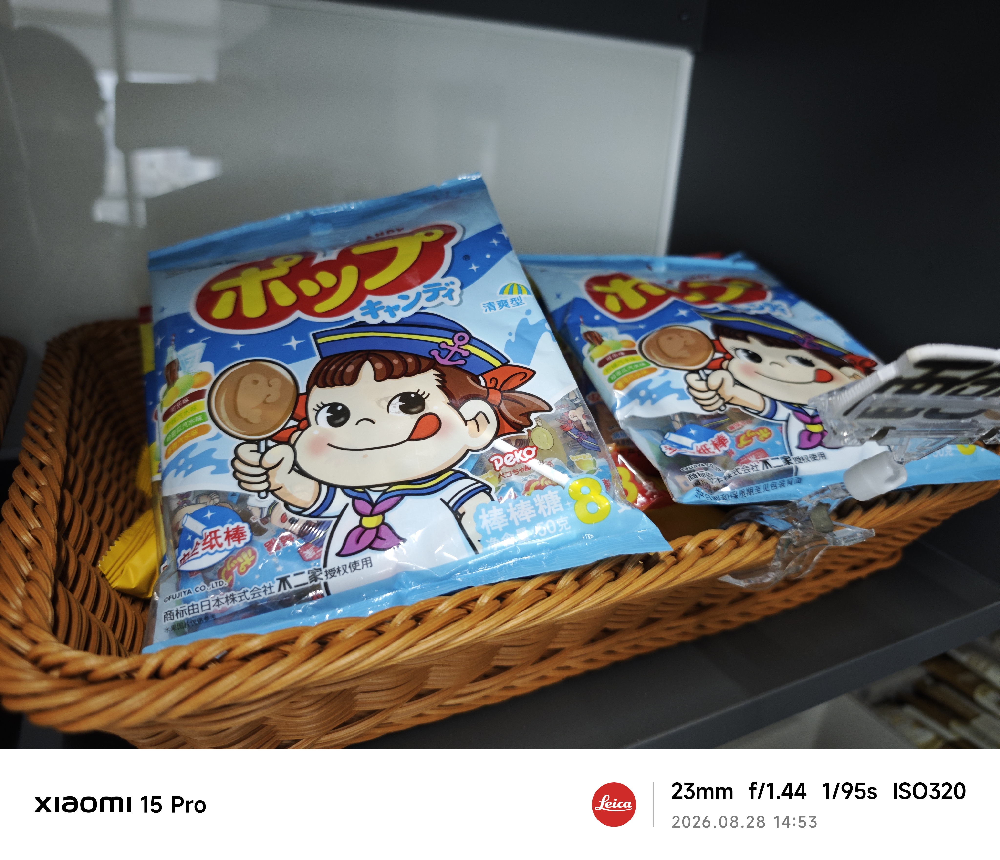
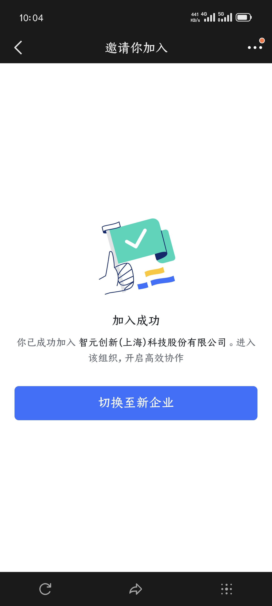
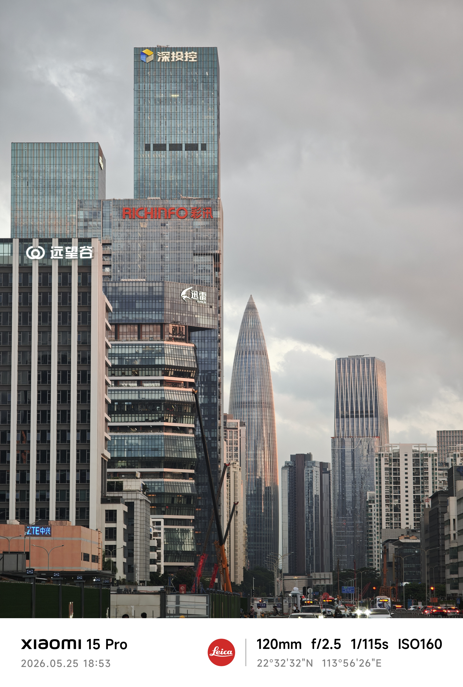

今天就是实习的最后一天了。从五月初算起，我已经实习了正好四个月。首先我要感谢我的mentor@李松卫、leader@王振、HR@顾张晨以及很厉害的学长@刘烨星，没有他们就没有现在的我。除此之外，我还要感谢中研硬件部和灵犀业务部的所有同事，他们在各个方面给予了我指导和帮助，使我从一名懵懂的学生不断向一名合格的硬件工程师靠近，逐渐熟悉并投入到硬件研发这份工作中来。

在这四个月里，我从参与灵犀 X2的售后工作开始，逐渐了解灵犀的硬件架构和电路设计，并在灵犀 X3研发过程中贡献了一块独立设计的PCB。在这四个月里，我看到过各部门团结一致，从每一个关节的建模、每一块PCB的绘制到成功点亮第一台X3；还见证了工程师们在个别问题上攻坚克难、数月如一日的不懈努力。

回望投递暑期实习的那段时间，智元是第一家给我offer的企业，加入智元也是我人生中的第一段实习经历。感谢智元对我的认可，给了我一个参与产品研发的机会，让我得以与真正有能力、有经验的硬件工程师协作，相互交流学习。在中研硬件部，没有大饼与办公室政治，学习技术、解决问题才是大家共同的追求。这段实习经历也让我意识到，要想成为真正的硬件工程师，我还需要在知识储备和协作能力上不断积累和打磨。

我还要特别感谢智元的行政部门，从夜宵领取方式的改变，到优化打卡、请假、工时填报流程，还有在遇到空调、网络故障时即刻响应，都让我感受到智元正在保障和提升大家的工作体验。

在此，我要再次感谢中研硬件部及所有深圳办公区的同事。祝愿所有研发人员在工作中势如破竹，祝愿智元机器人越来越好！

写完发现有些太客套了。最后，请大家吃棒棒糖吧，大家可以在36F茶水间自取。

